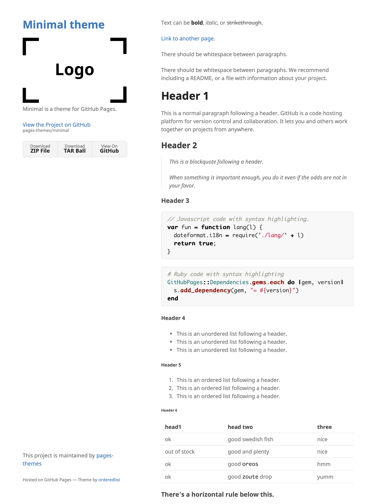

Themes that I looked at with my working notes.

## Hydejack

**Current** as of Nov 2024.

[Hydejack](https://hydejack.com) is my current theme (as of Nov 2024). It looks nice, but

* It has too many bells & whistles - yes, taste changes over time
* I got fed up with the entry page that I have to slide left

## al-folio
**Rejected** b/o too complex.

[al-folio](https://github.com/alshedivat/al-folio) looks good - with the picture of Einstein. It looks far less attractive with my face, it has too many areas I don't need. I played around with it (i.e. created a little personalized demo), and it feels complex.

## Mediumish
**Watched**

[Mediumish](https://github.com/wowthemesnet/mediumish-theme-jekyll?tab=readme-ov-file)

## Minimal Theme
**Watched**

[Minimal](https://pages-themes.github.io/minimal/)

## Cayman
**Watched**

[Caysman](https://github.com/pages-themes/cayman)

## Poole
**Wacthed**

[Poole](https://github.com/poole/poole)

## Lanyon
**Watched - Hot candidate**

[Lanyon](https://github.com/poole/lanyon)

## Celeste
**Watched**

[Celeste](https://github.com/nicoelayda/celeste)

## Hyde
**Watched**

[Hyde](https://github.com/poole/hyde)
