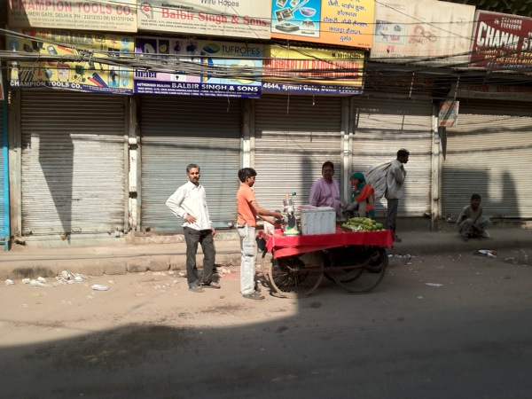
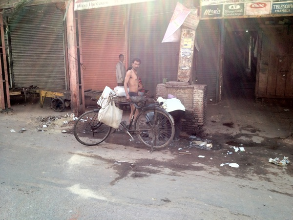
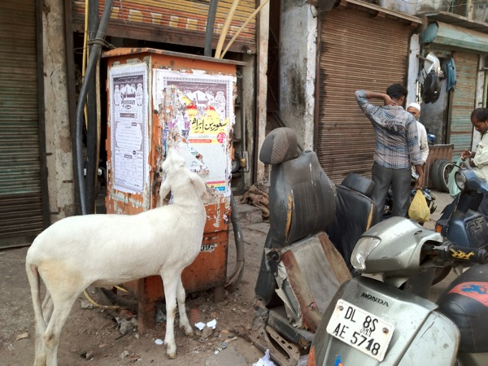
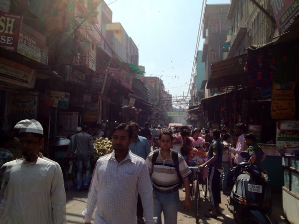
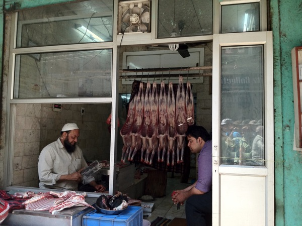
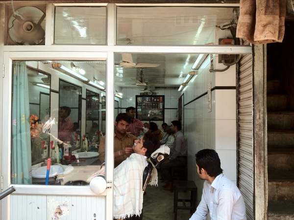
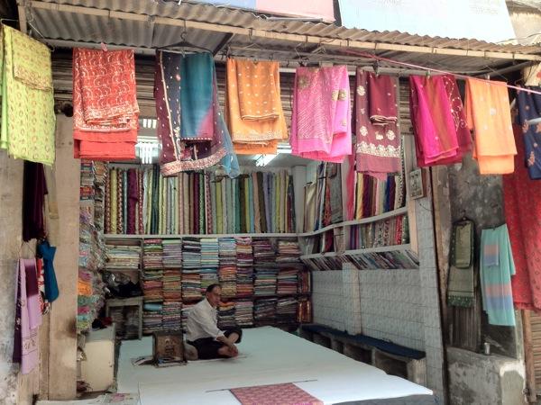
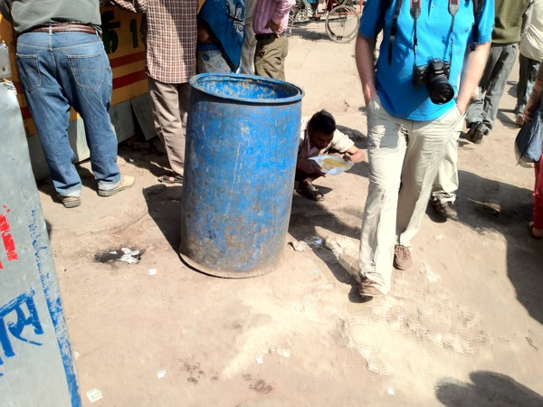

Heute war unser 2. Tag in Indien – schon wieder seeehr spannend!

Hier wieder die Fotostrecke:

Nachdem wir schön ausgeschlafen hatten, und der hiesige Rhythmus sich schon verdaut anfühlte (will heißen Jetlag OK), ging es mit der Metro nach Old Delhi. Wie der Name andeutet ist das der alte Teil von Delhi…

Old Delhi fühlt sich schon viel mehr so an, wie mir Indien von vielen Leuten vor meiner Abreise beschrieben wurde: Anderes Zeitalter..

Was auf den Fotos nicht ersichtlich ist, sind 2 Dinge, die die Eindrücke sehr stark prägen:

1. Der Lärm: Alle Rikschas, Autos, Laster, sogar die Fahrräder hupen und klingeln permanent und extrem laut. Da die Strassen in Old Delhi keine Einteilung von Fahrbahn und Bürgersteig haben, springt man die ganze Zeit auf die Seite um nicht überrollt oder angerempelt zu werden.

2. Die Gerüche: Alles riecht – meistens nicht gut…

Wie man sieht, ist die IT-Industrie in Indien omnipräsent: Hier prägt sie auch sehr stark das Strassenbild ;-)

Viele Leute waschen sich hier auf der Strasse – vielleicht weil Sonntag ist?

…und geschlafen wird auch im Auto – oder so…

Auch Tiere sieht man überall auf der Strasse

Und mittendrin – ein Tempel… Diesmal eine Moschee.

In der Moschee hat man den Einruck, ganze Familien würden hier wohnen:

Und so sieht die Moschee aus dem Eingangsbereich, über den großen Platz hinweg aus:

Anschließend ging’s zurück in das Gewusel der Gassen von Old Delhi

…wo alles verkauft wird…

…und man alles findet – auch an Dienstleistungen…

…aber auch spektakuläre Gewürzläden (und das ist noch nicht der Gewürzmarkt!)

Oder Stoffe (irgendwo müssen die Sargs ja herkommen)

Blicke nach oben sind immer wieder erstaunlich…

Anschließend ging’s ins Rote Fort. Das ist…ein Tempel…

Sagte ich schon, dass die Tempelanlagen hier häufig riesig groß sind?!

…und gefühlt an allen Ecken permanent gebaut wird?

Nach so viel Tempel wurden wir hungrig – wollten uns aber nicht zu einem der Herren gesellen die direkt auf der Straße essen, und sind in ein gepflegtes Touri-Restaurant gegangen…

Dann waren wir noch kurz in einem Eck dass vom englischen Kolonialstil geprägt ist: Connaught Place.

Anschließend ging’s mit der Metro ins Hotel, es wurde geduscht und wir trafen Indische Kollegen zum Abendessen. Jetzt ist es hier kurz vor Mitternacht, und ich gehe schlafen.

Gute Nacht,

– Till.
