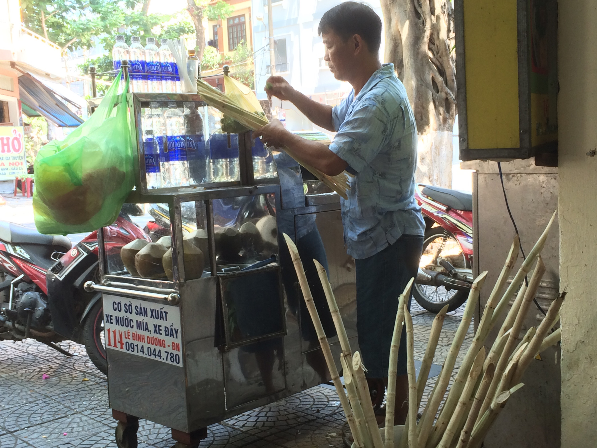
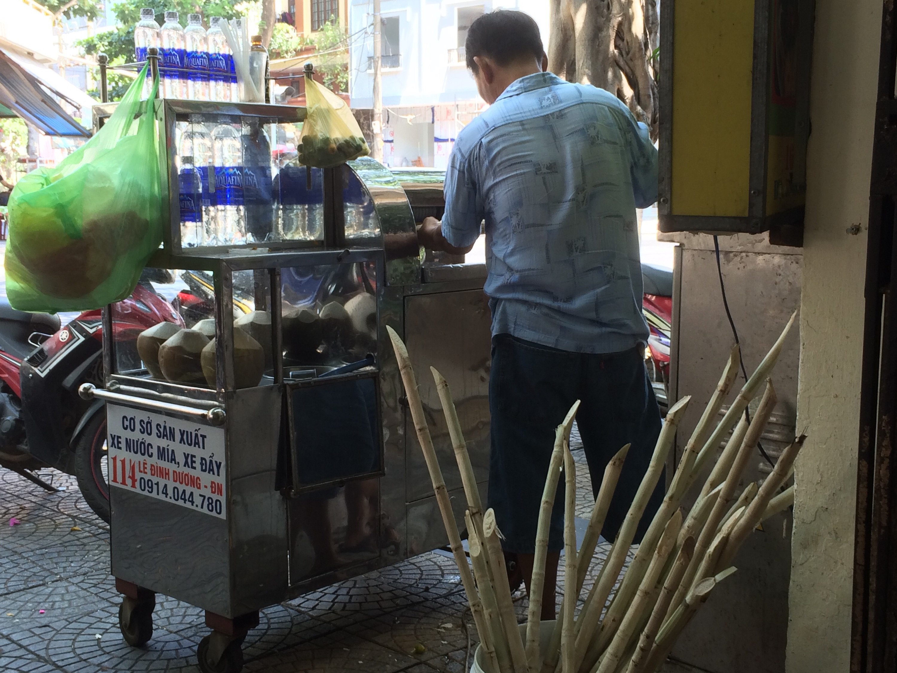
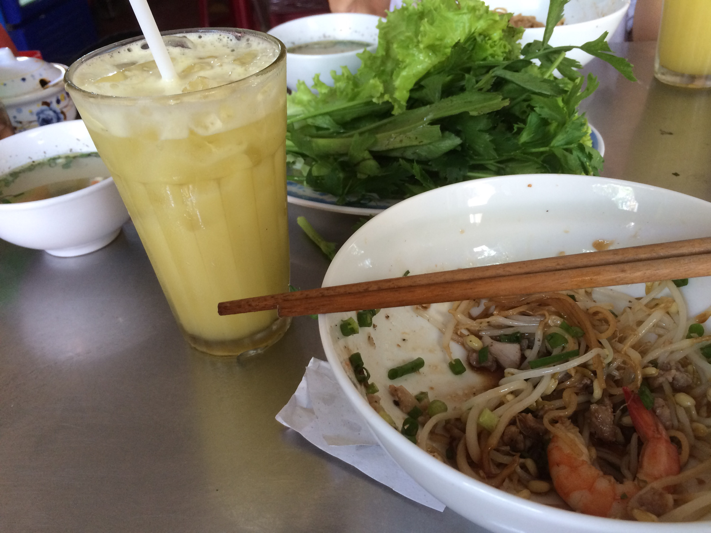

Just because it’s my last food shop in Da Nang (for this time), and because I never mentioned it.

With My, today for lunch. We went to a small food shop that she selected. I know 3 categories of Vietnamese food so far:

- Soupy
- Non-Soupy
- Rolly

Today we took non-soupy. Food was very good (as usual here), and for drinking we had freshly squeezed sugar cane juice: they have a bucket full of sugar canes an a nasty machine that badly squeezes. And the result tastes great!

Pics are self-explanatory:

