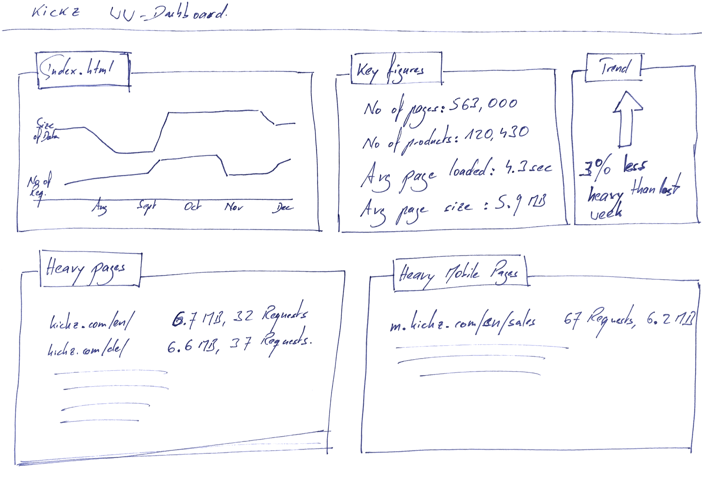

Good software developers test their stuff. And the [TDD (Test Driven Development)](https://www.wikiwand.com/en/Test-driven_development) addicts are maniacs when it comes to testing. Those guys usually think in code, be it Java, Python, nodeJS, you name it. TDD means you write tests first, then you code just as much as it takes to let the tests become green. Then you rework your code and only then you start writing tests for new requirements. 

This is **very** testy. My opinion is that if you do it the way it's written and described in the books you become awfully slow and it turns into nonsense. But that's another discussion, and not one I want to sort out here...

What's missing with most of the test approaches I have seen in the past are the following two things:

1. The test guys and test tools stop monitoring the software or website once it went into production. Somehow they feel that their responsibility ends with the going live...
2. They test the software. Not the rest, I.e. The design, the HTML, the CSS etc. And the user experience, the feeling wether what I see, touch, browse navigate is of good quality, is very much influenced by this packaging of the software logic. 

So I am looking for a tool to test (web based) software once it's out in the wild and throughout the entire user experience. Imagine a website, a simple blog. It might be perfect when it got launched, but over time it just degrades: the designers have added so many bells and whistles, the volume of the content has grown, it was tweaked to be more useable on mobiles... And eventually the site is bloated, heavy and slow. Why do I have to wait for my users to tell me (that would be complaining)? 

At [mgm technology partners](https://mgm-tp.com) we have automated test suites that run every night. So developers that built in code that slows down the software have a report that tells them every morning in their inbox. 

So here is what my SiteWeightWatcher should do:

- Run tests every 5-30 minutes against the production site
- Check all the pages, not just index.html
- Report immediately when pages become slow (that would be slower than they used to be)
- Track key figures and how they evolve over time:
- How much data is transferred for each page?
- How many requests are going back & forth?
- How much time does it take searching for products? Over time...  
- How well connected is the site for users in Germany, UK, US or Asia? Over time, because those things change without us having done anything.

I could imagine a dashboard for an online shop like [KICKZ.com](https://www.kickz.com/de) to look may this way:
A Dashboard that shows how page sizes evolve

And just as the normal test teams do, these tests should also evolve and become more and more adapted to the site, it's functionality and its users. Whenever we have a real problem or bug out there, we have to make sure that our WeightWatcher will find it in case it should appear or happen again. 

How could we start to build such a tool? Some thoughts:

- We have agents and a central server. The agents are located all around the globe or in different networks (think of little Docker images that run on different clouds). They report all their captured data to the central server. This is where the reports are generated and where interactive explication of the data is provided.
- The agents start collecting simple metrics:    
- No of HTTP requests per page    
- Data transferred per page    
- No of lines of JavaScript per page    
- Time to load the data    
- Time to execute JavaScript
- Based on this we start with simple reports:    
- What's the average page size?    
- What's the average no of requests per page?    
- What are my *heaviest* pages?    
- A graph that shows availability of my site as well as load time over a 24h scale, a week scale, a month. May be my users only experience slow loading in the evenings.

From there we we extend the data we collect as well as the reports. 

Such a tool would be great to monitor sites that I am in charge of (I.e. websites that we have developed at mgm) but could also give valuable information about other market players. It could be used both by technical people as well as the marketing guys - since they also *sometimes* break performance. I would be curious to see this kind of stats for Zalando 😜

Does anyone know about such a monitoring system? Please let me know.
