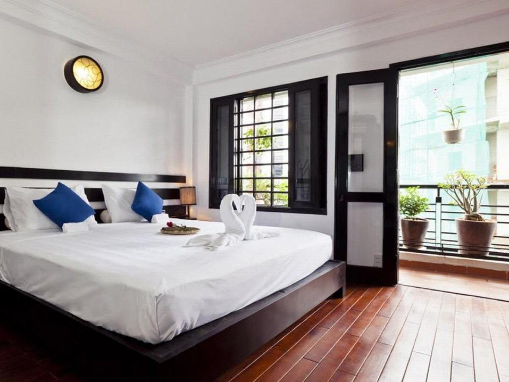
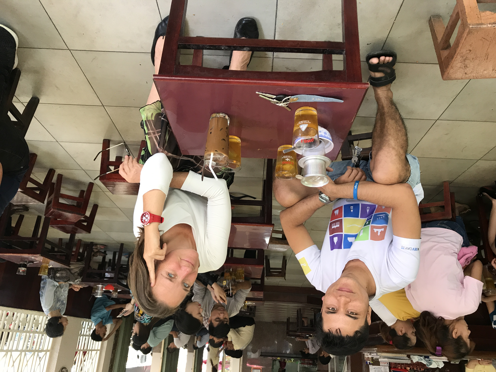
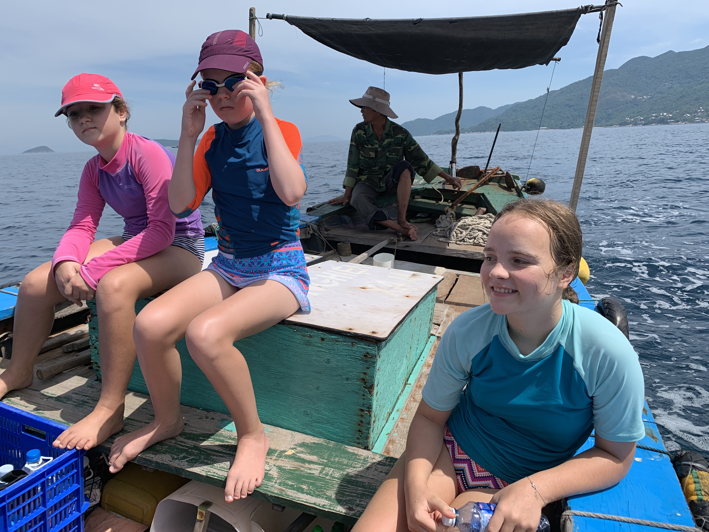

Neulich fragte mich ein Freund nach Tips für's Reisen in Vietnam: Ein Freund von ihm wollte für 10 Tage (!!) nach Vietnam reisen. Die Tips, die ich bei dieser Gelegenheit zusamengetragen habe, habe ich seitdem noch mindestens 5x weitergegeben. Deswegen schreibe ich sie jetzt hier auf. Und deshalb in der Dialog-Form...

_Servus Till - ein junger Kollege von mir fährt Mitte/Ende November mit einem Kumpel für 10 Tage nach Vietnam._
_Bis dato haben sie noch keine konkreten Pläne. Hast Du ein paar Tipps was Mannas Tourist in Vietnam unbedingt gesehen haben sollte?_
_Herzlichen Dank schon mal._
_LG_

Umpf, das ist nicht ganz einfach. Hängt ab davon, was er so mag: eher Stadt, Natur, Party, Museen...

Er wird ziemlich sicher in **Hanoi** oder **Saigon** landen. Die jeweilige Stadt sollte er sich jedenfalls anschauen- und wahrscheinlich den Jetlag ausschlafen.

- [Cinnamon Cathedral Hotel38 Ấu Triệu, Hàng Trống, Hoàn Kiếm, Hà Nội, Vietnam+84 24 3938 6761](https://goo.gl/maps/JtbFi8FVmn416DC27)
- [Cinnamon Hotel Saigon74 Lê Thị Riêng, Phường Phạm Ngũ Lão, Quận 1, Hồ Chí Minh, Vietnam+84 28 3926 0130](https://goo.gl/maps/WFWoCD2ZUEgm2i9x5)

Hotel in Hanoi & Saigon wo ich gerne absteige. Sehr nett, klein (ich mag die großen Kästen nicht), vietnamesisch, super zentral...

---

In beiden Städten gilt: **ESSEN!** Streetfood, typische Gerichte jeweils. Alles probieren, mutig sein 😂Rumkommen: Grab bike. Ist wir Uber. App installieren, auf Karte klicken, moped kommt. Man sitzt hinten drauf und sieht alles aus vietnamesischer Perspektive. Auto steht nur im Stau.

---

In Saigon habe ich mal eine ganz tolle **Vespa Tour** ins Mekong Delta gemacht. Einen Tag lang, hinten auf einer Vespa.Die Touren gibt’s auch in Hanoi und Hoi An: [Vespa-Adventures](https://vespaadventuretours.com)

---

**Kaffee**: VN ist der grösste Kaffeeproduzent der Welt. Haben ganz eigene Kaffeekultur. Drinken Coffee Phin. Ein junger Kaffeebauer aus dem Hochland (Da Lat, auch sehr sehenswert) hat den coolsten coffee shop in Saigon:
[The Workshop Coffee27 Ngô Đức Kế, Bến Nghé, Quận 1, Hồ Chí Minh, Vietnam+84 28 3824 6801](https://goo.gl/maps/uyV7neisEPLL8mgJA)

Merke: Original ist der Kaffee nur, wenn man auf viel zu kleinen Hockern an viel zu kleinen Tischen sitzt ;)

---

Highlights in Sachen Natur war für uns der Norden: **Berge**, **Dschungel**, wunderschön. Sa Pa ist das Chamonix von VN: die Stadt ist scheußlich, aber von dort gehen schöne Touren ab. Der [Fansipan](https://de.wikipedia.org/wiki/Fansipan), höchster Gipfel VNs, gilt als letzter Gipfel des Himalayas. Inzwischen geht auch Gondel rauf. Ist aber alles recht voll. Besser hat uns der Nord-Osten gefallen: weniger Touristen, ursprünglicher. Der Ort heisst Ha Giang. Zu besuchen am besten mit Moped, wenn man sich traut. Wenn man dort wandern will ist das Panhou Village ein tolles Basislager (dort bekommt man auch Führer).
[Ecolodge Panhou VillageThông Nguyên, Hoàng Su Phì District, Ha Giang, Vietnam+84 96 661 50 50](https://goo.gl/maps/BwKQgb6QLVN8prxy9)

---

Unsere Gegend war Strand: Zentralvietnam, mit **Đà Nẵng** und **Hội An**. Đà Nẵng ist vietnamesisch, mittlere Stadt. Hội An ist UNESCO Weltkulturerbe, dementsprechend voll mit Touristen. Neben den typischen Landmarks aus dem Reiseführer war unser Highlight **Tauchen**. Kann man auch als nicht-Taucher, quasi reinschnuppern und mal probieren. Wenn tauchen, dann sagen dass man von Till kommt - dann wird der Service netter & günstiger. Jeder Dive Master reagiert auf den Namen 😀
[Vietnam Scuba Diving](https://vietnamscubadiving.com)

---

Nördlich des Wolkenpasses ist die alte Kaiserstadt **Huế**. Sehr nett - auch wieder das Essen. Neben dem Palast, Perfume river und standard-Orten ist folgendes Hotel sehr empfehlenswert: Luxus aus dem letzten Jahrhundert, sehr netter Service, direkt am Strand...
[Villa Louise Huế - Beach Hotel and Spathôn Hòa Duân, Phú Vang District, Thua Thien Hue 530000, Vietnam+84 91 767 36 56](https://goo.gl/maps/QrQpgRNayjeXdWYS7)
Zwischen Đà Nẵng und Huế ist der Zug empfehlenswert: man sieht viel, kann mit den Vietnamesen ratschen - und an den Stationen tolles Essen von den mobilen Händlern kaufen.

---

Mit dem Zug noch weiter nördlich geht’s nach Đồng Hới: in dieser Gegend sind die **größten Höhlen der Welt**. Wir waren 4x dort, haben unterschiedliche Höhlen besucht, zT SEHR abenteuerlich. Besten Führer und Ausrüstung:
[Oxalis](https://oxalisadventure.com)

---

10 Tage?? Reicht nie für VN 😂
So, und sitze im Bus von Prag nach München und habe jetzt Lust auf Vietnamesisches Essen...
LG,
Till.
