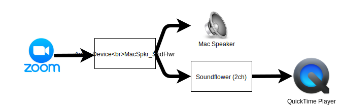
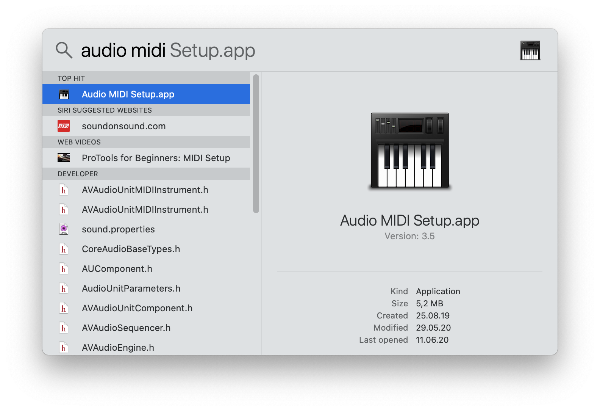
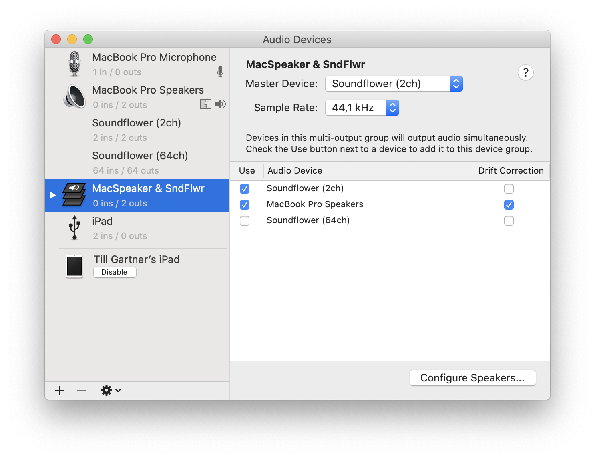
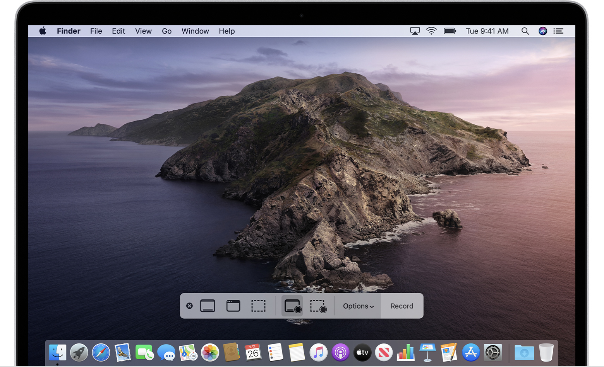

**TL;DR** In order to record the screen of your Mac together with the sound (i.e. a Zoom session) you can use Soundflower.

Here is what I wanted to achieve: Make a (video) recording of what is happening on the screen of my Mac **including the sound**. All this, while still hearing what is happening at the same time. In my case I wanted to record a Zoom-Class, but I guess this is a setup that might be useful in many situations.

macOS comes with a great built-in screen recording tool:[QuickTime Player](https://support.apple.com/en-us/HT208721) (yes, it records, even though the name says _player_ 😀).

When using QuickTime Player the only problem is the sound: The choices you have are _Internal Microphone_ or _None_. That fits well if you want to record a tutorial where the sound is what you explain through the microphone, but it doesn't fit my situation.

This is where [SoundFlower](https://github.com/mattingalls/Soundflower) comes in the picture. It's Open Source, mature and reliable (tested by me and far more experienced fellows - and always got very good reviews). SoundFlower as it is today (that's Summer 2020) is not a program with a User Interface, but only a MacOS system extension. That's something you don't see as a user but that is very helpful in the background.

What it does in our case: It creates a new, virtual sound channel that splits the sound stream into 2 other streams. In my case it means that in my Zoom session I select a virtual output instead of the speaker of my Mac. I called this output _MacSpkr_SndFlwr_. And this virtual stream splits the output to the Speaker of the Mac and the (logical) SoundFlower channel. Then I select the SoundFlower channel as input to my QuickTime Player Recording and that's it.

The Sound Streams

## Setting it all up

**Installing Soundflower** is well described on it's [download page on Github](https://github.com/mattingalls/Soundflower/releases/tag/2.0b2). The process might seem a bit clumsy but works well if you follow it step by step. Note that it took me a while to figure out what they meant by "_Once there, there should be an "Allow" button (\*\*) that you will need to click on to give permission to use Soundflower (developer: MATT INGALLS)._" I was expecting a popup dialog with the Allow-button, but it's simply a button within the window.

Also note that you need to reboot your Mac after installing Soundflower.

Once you have Soundflower installed you can create a logical Audio Device that will be slipping the sound stream. To do so, open *Audio MIDI Setup*. It is a macOS utility program located in /Applications/Utilities. You can also start it via Spotlight (hit Cmd + Space) and enter "_Audio Midi"_

_Starting the Audio MIDI Setup via Spotlight_

Once you are in the Audio MIDI Setup program, create a new (logical) Audio Device: hit the "**+**" button in the bottom left corner and select "_Create Multi Output Device_". In the the panel that appears on the right, select "_MacBook Speaker_" AND "_Soundflower (2ch)_".

_The newly created Multi Output Device_

Then launch your QuickTime Player (this one comes pre-installed on your Mac) and create a new Screen Recording: Menu _File ➡ New Screen Recording_. In the lower part of the screen a floating menu appears:

_The floating menu when recording with QuickTime Player_

Open the Options list and select "Soundflower (2ch)" as input for the recording. Click on "Record" and off you go: Now start your Zoom session, maximize the window and your entire Zoom session will be recorded in a .mov file.

I hope this instructions were helpful; feel free to ask questions if you have any.

### References

- _How to record the screen on your Mac_ from [Apple Support](https://support.apple.com/en-us/HT208721)
- [Soundflower explanations](https://github.com/mattingalls/Soundflower/releases/tag/2.0b2)
- _Record your computer's screen with audio on a Mac_ from [c|net](https://www.cnet.com/how-to/record-your-computers-screen-with-audio-on-a-mac/)
