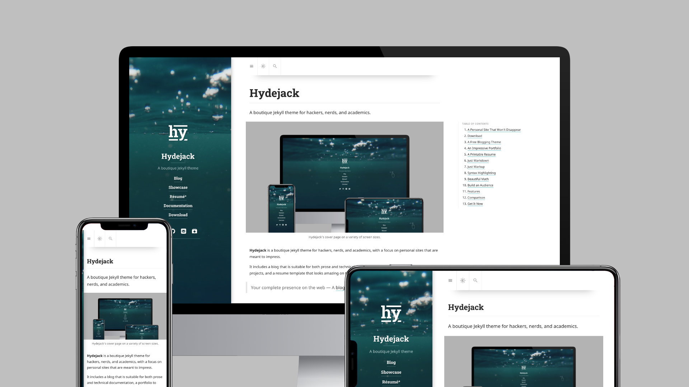
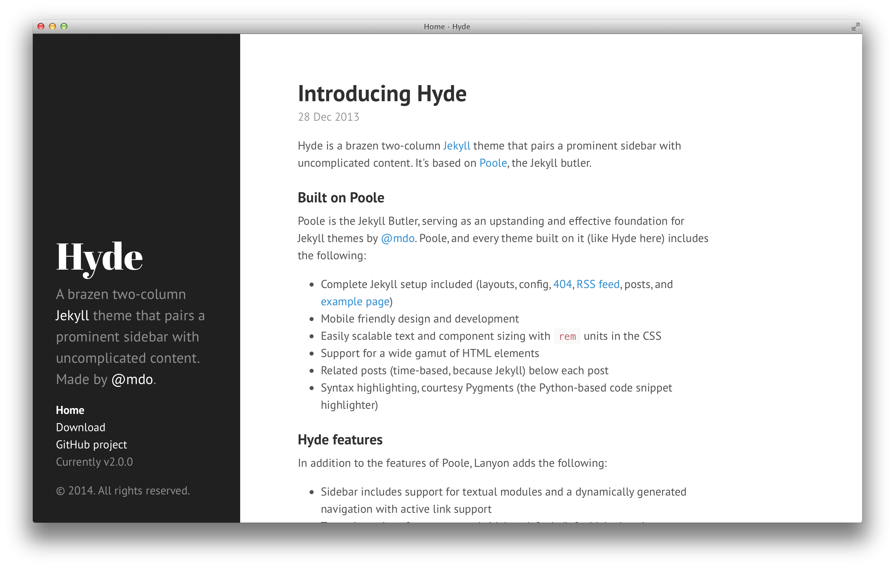
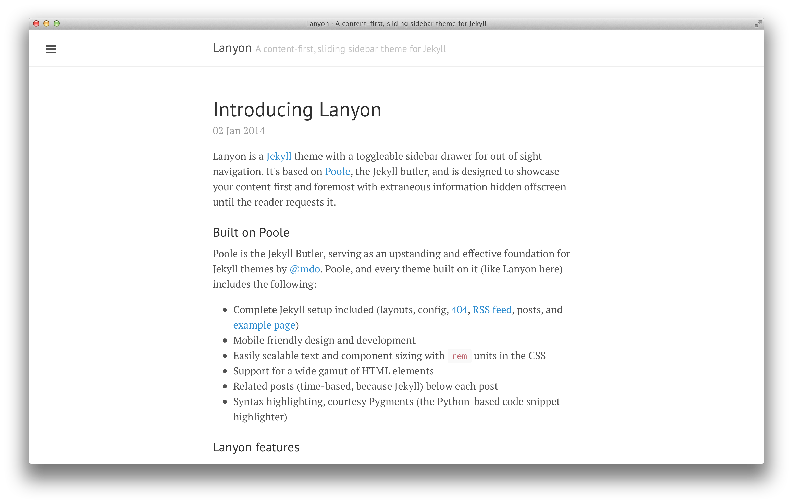
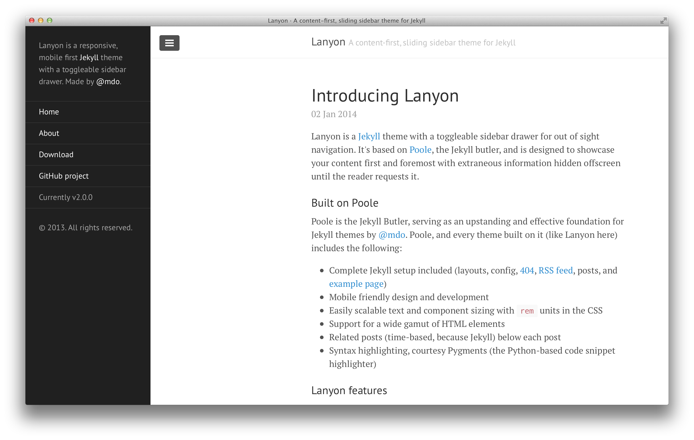
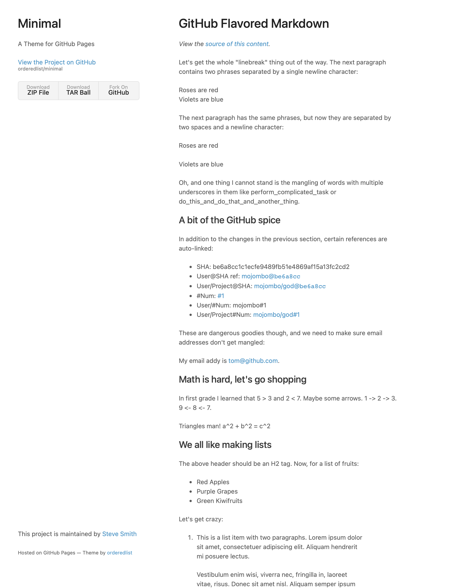
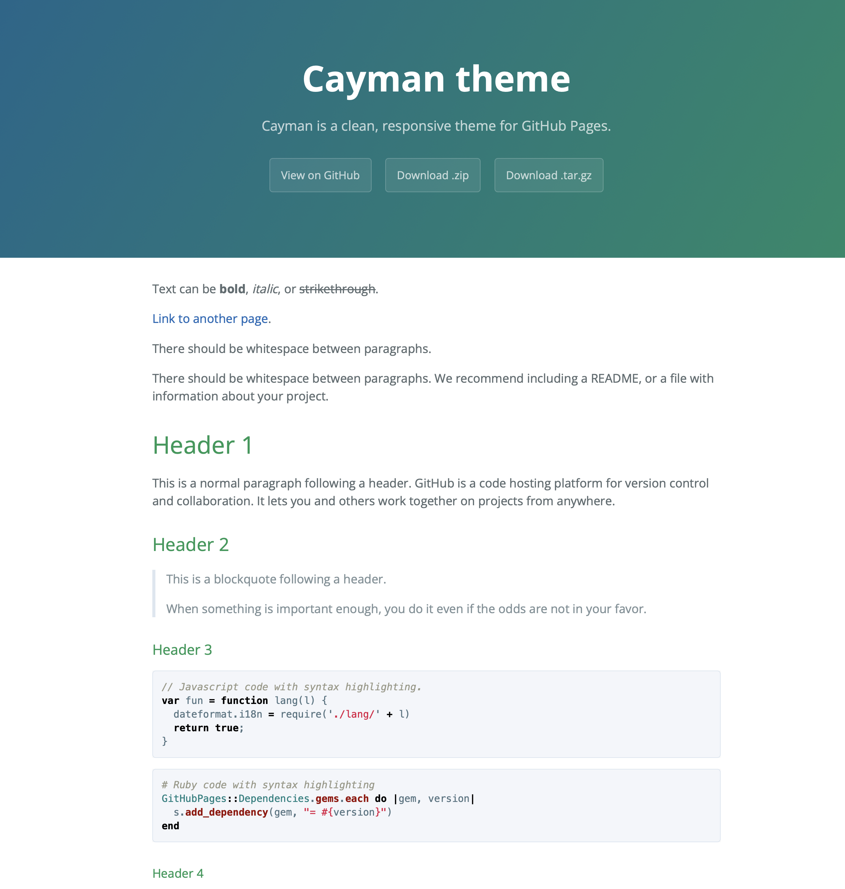
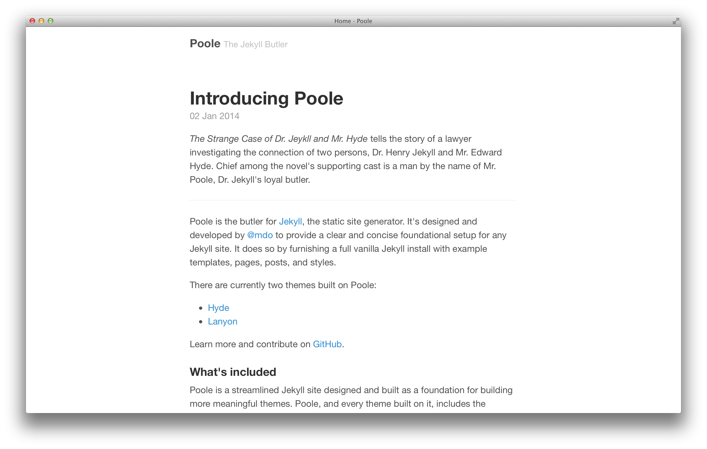
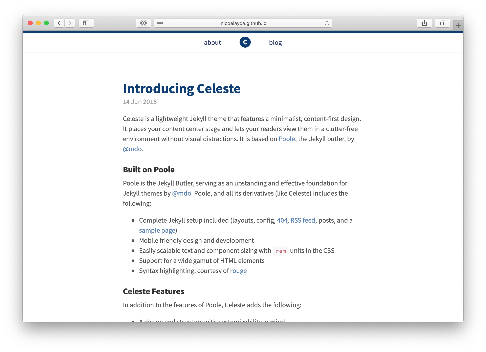
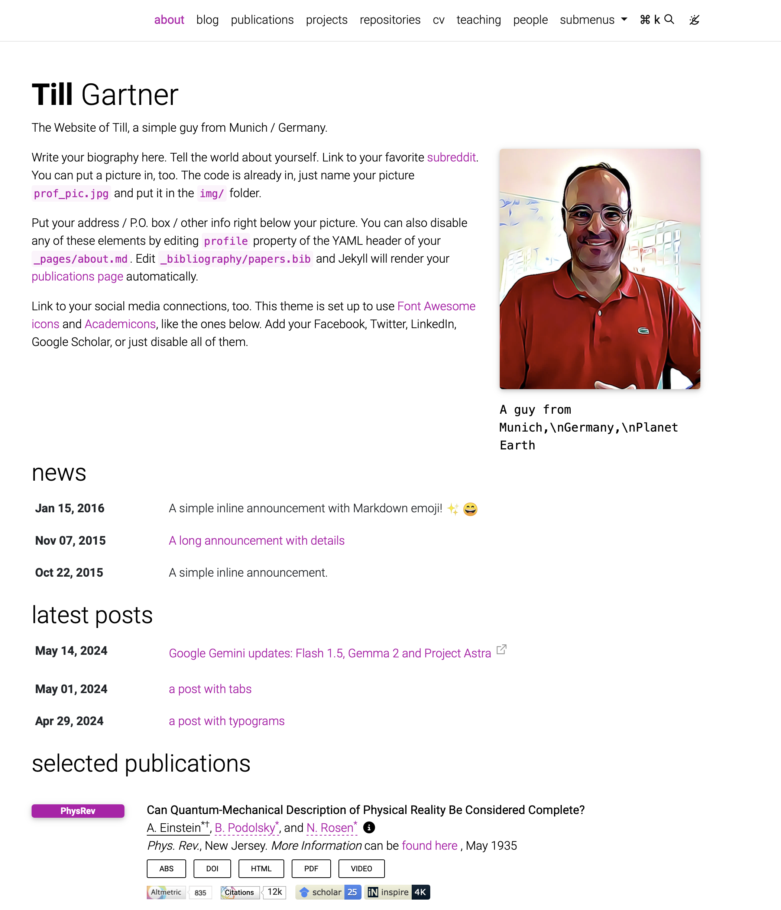

Themes that I looked at with my working notes.

## Hydejack

**Current** as of Nov 2024.

[Hydejack](https://hydejack.com) is my current theme (as of Nov 2024). It looks nice, but

- It has too many bells & whistles - yes, taste changes over time
- I got fed up with the entry page that I have to slide left

---

## Hyde

**Being stdied - Hottest candidate**

[Hyde](https://github.com/poole/hyde)

---

## Lanyon

**Being studied - Hot candidate**

[Lanyon](https://github.com/poole/lanyon)

---

## Minimal Theme

**Being studied**

[Minimal](https://github.com/orderedlist/minimal)

---

## Cayman

**Being studied**

[Caysman](https://github.com/pages-themes/cayman)

---

## Poole

**Rejected** because I understodd that it's just a base theme. Hyde and Lanyon are based on it.

[Poole](https://github.com/poole/poole)

---

## Celeste

**Being studied**

[Celeste](https://github.com/nicoelayda/celeste)

---

## Minimal Mistakes

**Being studied**

[Minimal Mistakes](https://github.com/mmistakes/minimal-mistakes)

---

## Mediumish

**Being studied - probably too fancy**

[Mediumish](https://github.com/wowthemesnet/mediumish-theme-jekyll?tab=readme-ov-file)

---

## al-folio

**Rejected** b/o too complex.

[al-folio](https://github.com/alshedivat/al-folio) looks good - with the picture of Einstein. It looks far less attractive with my face, it has too many areas I don't need. I played around with it (i.e. created a little personalized demo), and it feels complex.

---
