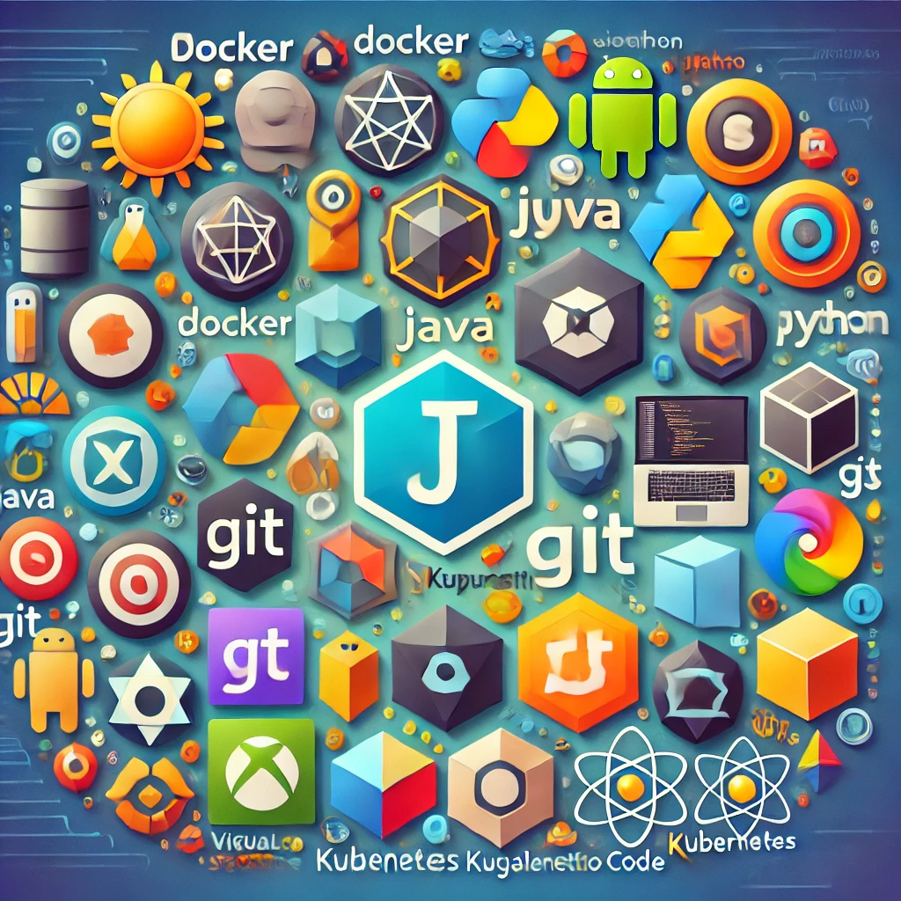
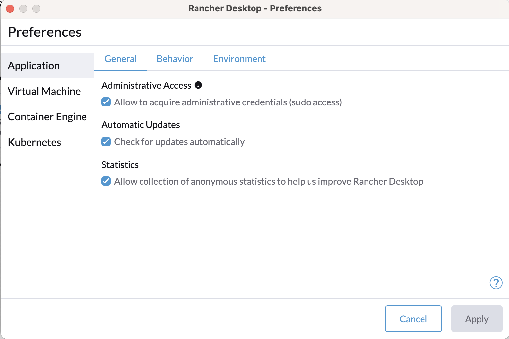

I am not a professional developer, I do it for fun. And I like to play around, discover new technologies,. development all kinds of little things. So sometimes I need Python, sometimes React/Typescript, Java and more. For every development tool or langugae there are multiple options on how to install them and manage their versions. Since I tend to forget things like "How did I install Python oin this machine?", this is a note to future me, telling me how I installed every development tool. 

As the way how certain packages are installed might change over time, I will add dates to my installation choices.

[TOC]

## Xcode

Xcode is the basic dev tooling on Mac. It contains git and other basic tools and compilers.

I install it from the Apple App Store.

## Terminal

My Terminal of choice is [iTerm2](https://iterm2.com), and I simply install it from it's website. See [here](setting-up-my-terminal) for how I configure it.

## zsh shell

## VSCode 

... or VSCode-insiders

## Docker

**January 2025:** I switched away from [Docker Desktop](https://www.docker.com/products/docker-desktop/) to [Rancher Desktop](https://rancherdesktop.io).

Installation note: Downloaded the Apple Silicon version, opened the DMG and copied it into my Applications directory. The only detail I needed to do, is tick the "Administrative Access" checkbox in the setting.


*Registry*: I use different registries when working on different projects. 

*Question*: How do I configure docker so that it pulls images from a specific registry?

## Java

These are the option I saw:

* [jenv](https://github.com/jenv/jenv)
* [SDK man](https://sdkman.io)

**Januar 2025**: I decided to use SDK Man as it also covers Maven. 

**Mini-Cheatsheet**

* `sdk install java 17.0.12-jbr` install this specific Jaa version
* `sdk list java` shows all available Java version (available to install)
* To list the installed java versions:
  * `sdk oofline enable`, so it will list only locally installed versions
  * `sdk list java`
  * `sdk offline disable`
* `sdk default java 21.0.6-amzn` sets this version as default
To set a java version as default inside a directory, see the [Env command](https://sdkman.io/usage/#env-command)

## Maven
I simply use `brew install maven`. For older version `brew install maven30` installs Maven 3.0.

## Gradle

**January 2025**: I decide to use SDK Man for Gradle as well.

Reason: `brew install gradle` installed Gradle Version 8.12.1, but for the current Project I needed 8.5. 

* `sdk install gradle 8.5`: Installs teh specific gradle version
* `sdk use gradle 8.5`

## Node and npm

**January 2025** I decided to use [nvm](https://github.com/nvm-sh/nvm). 

**Mini-Cheatsheet**

* `nvm use 16`
* `node -v` shows the version currently being used
* `nvm install 12` installs node 12 and uses it

## Python

* **Summer 2024**:I use [pyenv](https://github.com/pyenv/pyenv)
* To install pyenv: `brew install pyenv`

**Mini-Cheatsheet**

Select a Pyenv-installed Python as the version to use, run one of the following commands:

```shell
pyenv install 3.12
pyenv shell <version> -- select just for current shell session
pyenv local <version> -- automatically select whenever you are in the current directory (or its subdirectories)
pyenv global <version> -- select globally for your user account
```

## Ruby

Not thought yet. Avoid Ruby in general... 😉
