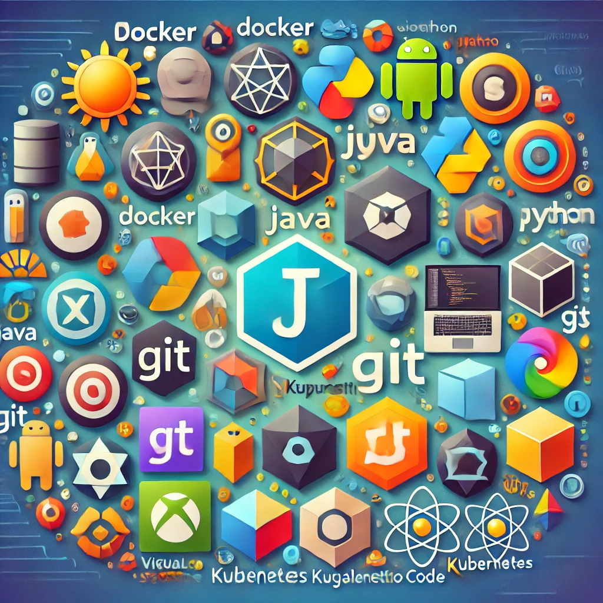
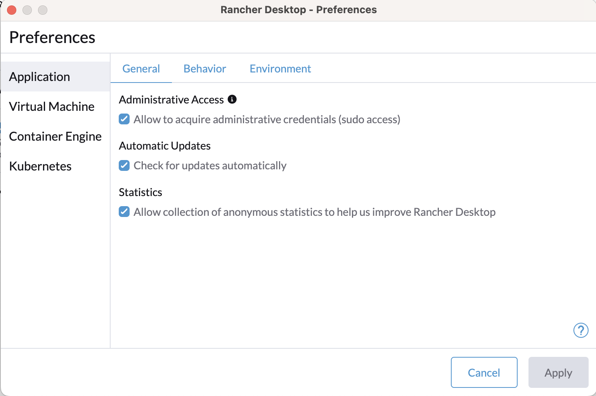

I am not a professional developer, I do it for fun. And I like to play around, discover new technologies,. development all kinds of little things. So sometimes I need Python, sometimes React/Typescript, Java and more. For every development tool or langugae there are multiple options on how to install them and manage their versions. Since I tend to forget things like "How did I install Python oin this machine?", this is a note to future me, telling me how I installed every development tool.

As the way how certain packages are installed might change over time, I will add dates to my installation choices.

[TOC]

## Xcode

Xcode is the basic dev tooling on Mac. It contains git and other basic tools and compilers.

I install it from the Apple App Store.

## Terminal

My Terminal of choice is [iTerm2](https://iterm2.com), and I simply install it from it's website. See [here](/setting-up-my-terminal/) for how I configure it.

## zsh shell

On a new Mac, here is what I do:

```shell
# Check what Shell I have
echo "$SHELL"

# In case it's not zsh, set it as default
chsh -s "$(which zsh)"

```

## VSCode

... or VSCode-insiders

**Extensions:**

- **markdownlint** by David Anson (`davidanson.vscode-markdownlint`) - The de facto standard for markdown linting with 10M+ downloads. Underlines issues inline and can auto-fix on save.
  `code --install-extension davidanson.vscode-markdownlint`
  Configuration files are searched in order: `.markdownlint.jsonc`, `.markdownlint.json`, `.markdownlint.yaml`/`.yml`, or `.markdownlintrc`. (Added January 2026)

- **Prettier** (`esbenp.prettier-vscode`) - Code formatter.
  `code --install-extension esbenp.prettier-vscode`
  Enable format on save in VS Code settings:

  ```json
  {
    "[markdown]": {
      "editor.defaultFormatter": "esbenp.prettier-vscode",
      "editor.formatOnSave": true
    }
  }
  ```

  (Added January 2026)

## Docker

**January 2025:** I switched away from [Docker Desktop](https://www.docker.com/products/docker-desktop/) to [Rancher Desktop](https://rancherdesktop.io).

Installation note: Downloaded the Apple Silicon version, opened the DMG and copied it into my Applications directory. The only detail I needed to do, is tick the "Administrative Access" checkbox in the setting.


_Registry_: I use different registries when working on different projects.

_Question_: How do I configure docker so that it pulls images from a specific registry?

## Java

These are the option I saw:

- [jenv](https://github.com/jenv/jenv)
- [SDK man](https://sdkman.io)

**Januar 2025**: I decided to use SDK Man as it also covers Maven.

**Mini-Cheatsheet**

- `sdk install java 17.0.12-jbr` install this specific Jaa version
- `sdk list java` shows all available Java version (available to install)
- To list the installed java versions:
  - `sdk oofline enable`, so it will list only locally installed versions
  - `sdk list java`
  - `sdk offline disable`
- `sdk default java 21.0.6-amzn` sets this version as default
  To set a java version as default inside a directory, see the [Env command](https://sdkman.io/usage/#env-command)

## Maven

I simply use `brew install maven`. For older version `brew install maven30` installs Maven 3.0.

## Gradle

**January 2025**: I decide to use SDK Man for Gradle as well.

Reason: `brew install gradle` installed Gradle Version 8.12.1, but for the current Project I needed 8.5.

- `sdk install gradle 8.5`: Installs teh specific gradle version
- `sdk use gradle 8.5`

## Node and npm

**January 2025** I decided to use [nvm](https://github.com/nvm-sh/nvm).

**Mini-Cheatsheet**

- `nvm use 16`
- `node -v` shows the version currently being used
- `nvm install 12` installs node 12 and uses it

## Python

- **Summer 2024**:I use [pyenv](https://github.com/pyenv/pyenv)
- To install pyenv: `brew install pyenv`

**Mini-Cheatsheet**

Select a Pyenv-installed Python as the version to use, run one of the following commands:

```shell
pyenv install 3.12
pyenv shell <version> -- select just for current shell session
pyenv local <version> -- automatically select whenever you are in the current directory (or its subdirectories)
pyenv global <version> -- select globally for your user account
```

## uv (Python CLI tools)

[uv](https://docs.astral.sh/uv/) is a fast Python package manager written in Rust. I use it for one specific job: installing standalone Python command-line tools in their own isolated environments, without touching the Python that [pyenv](#python) manages for my projects. So pyenv stays my per-project Python version manager, and uv is how I install global Python apps.

**June 2026**: Installed via Homebrew. uv itself is a single self-contained binary with no Python runtime of its own, so brew is the right channel:

`brew install uv`

uv does not bundle Python: when a tool needs an interpreter, uv either reuses one it finds or downloads a managed standalone Python automatically and caches it. That means a tool installed this way keeps working no matter what I later do with pyenv.

**Mini-Cheatsheet**

- `uv tool install <package>` installs a Python CLI tool in its own isolated environment (binaries land in `~/.local/bin`)
- `uv tool list` lists installed tools and the commands they expose
- `uv tool upgrade <package>` / `uv tool upgrade --all` upgrades them
- `uv tool uninstall <package>` removes a tool
- `uv tool install --python 3.12 <package>` pins the interpreter for that tool

For example, I installed [graphify](https://pypi.org/project/graphifyy/) (a knowledge-graph CLI) with `uv tool install graphifyy` — note the PyPI package is `graphifyy` (double y) while the command is `graphify`.

## Markdown Linting

`brew install markdownlint-cli2`

## Ruby

Not thought yet. Avoid Ruby in general... 😉
