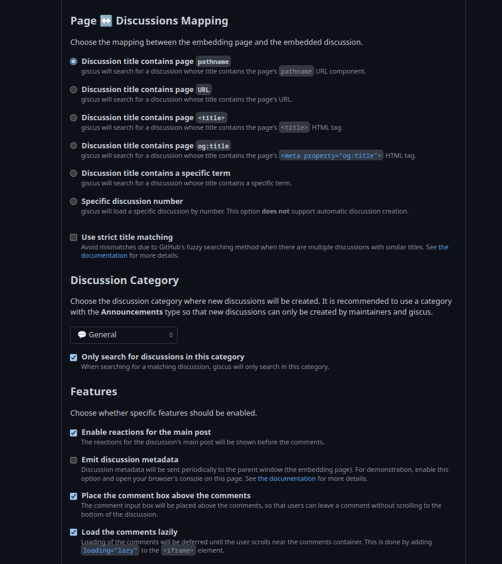

**TL;DR:** I added comments to my static website. Here's how I did it - including some technical details. I researched amongst different possible solutions for the most solid one, integrated it for all posts and added a counter of the number of comments in the post overview page.

**2025-05-23 Update** Since I moved from Jekyll to [Pelican](https://getpelican.com), I updated some details.

## Selecting a solution

As i planned to play around with the new [Deep Research Model from OpenAI](https://openai.com/index/introducing-deep-research/) I gave it a spin with this topic: [feel free to read here](https://chatgpt.com/share/67a8aea4-9bc8-8009-917b-8855ebdd4776). Overall the research was helpful and I ended up using [Giscus](https://giscus.app/) for the comments. Partly because it felt the most robust and reliable, partly because I had really bad expoerience with disqus some years ago.

The choice was based on the set of criteria I gave to the model. Here are the most important ones:

- No self-hosted server – I don't want to manage (and pay 😉) a server.
- Data portability – the comments can exported.
- Privacy-friendly – no extra trackers or ads beyond what I already use (e.g. Google Analytics).
- Markdown support – allow rich formatting (code blocks, etc.) suited for technical discussions.
- Spam protection – has measures to reduce spam, especially if allowing anonymous or unauthenticated comments.

The tools that Deep Research _analyzed_ were

- Giscus
- Utterances
- Staticman
- Commento
- Hyvor Talk
- Disqus
- Some _self made_ solutions

## Integrating Giscus

In the follow up to it's research I asked the model to give me a step by step guide on how to integrate the solution. This was far less reliable than the first research, but still helpful.

Here is the executive summary (the details are in the [chat I had with the AI](https://chatgpt.com/share/67a8aea4-9bc8-8009-917b-8855ebdd4776)):

- Step 1: Enable GitHub Discussions for Your Repository. That means the repo into which the static site is generated (which sometimes is not the same as the source).
  - Go to your GitHub repository
  - Navigate to Settings > General.
  - Scroll down to the Discussions section and enable it.
- Step in between, that the AI missed to mention: Install giscus for all or some of your repos. [Here](https://github.com/apps/giscus/installations/select_target)
  
- Step 2: Install Giscus and Configure It
  - Visit the Giscus setup page: https://giscus.app/.
  - Under "Repository", enter your repo name. You now should see the green check mark that your repo meets all the criteria for using giscus.
  - The “Page discussion mapping” option dictates a relationship between your pages, e.g an article, and a GitHub discussion. I selected, the pathname
  - For the discussions category I selected “general”.
    Set the Theme to "Match OS" or manually define light and dark mode.
    Click "Copy Code" once you’ve generated the <script> tag.



- Step 3: Add Giscus to Your Jekyll Post Template (or Pelican 😀). - - Step 4: Style Giscus to Match Lanyon Theme. I skipped this one, as the styling looked pretty good _naked_ to me.
- Step 5: Display Comment Count in Post Summaries (see below)
- Step 6: Commit and Push Changes - Duh...
- Step 7: Test Your Setup

## Adding the comment counter

After fiddling around a bit and smoothing the edges everything worked fine. But there was one feature I miussed: I wanted to see the number of comments a blog post has in the post overview page.

{: style="box-shadow: 0 4px 8px rgba(0, 0, 0, 0.2);"}

So I spun up ChatGPT again and got another [research result](https://chatgpt.com/share/67ab5f69-4ddc-8009-8471-a35e00cb6a43). The rough steps are:

- Step 1: Add a Placeholder for Comment Count. In my [`post_preview.html`](https://github.com/tillg/grtnr.com_2024/blob/main/_includes/post_preview.html) I added a `<span>` that actually needed to be a bit different from what the AI suggested:

  ```html
  <span class="comment-count" data-giscus-comments="{{ post.url }}">
    <span class="comment-num">Counting comments...</span>
  </span>
  ```

- Step 2: Add JavaScript to Fetch the Comment Count. I added a script that fetches the comment count from the GitHub Discussions API and updates the comment count. The script suggested needed some fixes and ended up in this [Event Listener](https://github.com/tillg/grtnr.com_2024/blob/main/assets/js/giscus-comments.js). Don't be surprised by the two lines with dashes (---) at the top, I'll explain them below... Noteworthy here are
  - Dealing with the `accessToken` (explained below)
  - This argument of the grahQL query: `categoryId: "DIC_kwDONYRp_c4Cm0cH"`. This is the ID of the category that contains the discussions of the repository.
  - Note: What helped me for debugging & fixing this function is the [Github GraphQL Explorer](https://docs.github.com/en/graphql/overview/explorer).
- Step 3: Include the JavaScript in Your Jekyll Site. In my case I added this script reference at the bottom of the [`default.html` layout file](https://github.com/tillg/grtnr.com_2024/blob/main/_layouts/default.html).
- Step 4: Test the Comment Count. After some testing and fixing, it worked eventually locally.

The following aspects kept me busy an hour or two:

- The `accessToken`, where and how to get it
- How to get the access token published to Github w/o the token-scanner and protector kicking in
