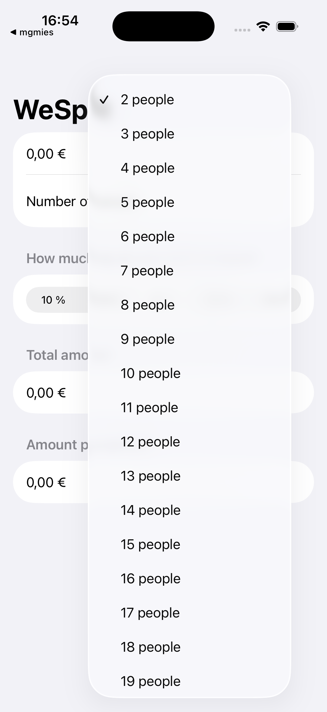
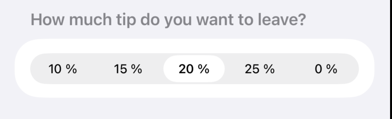
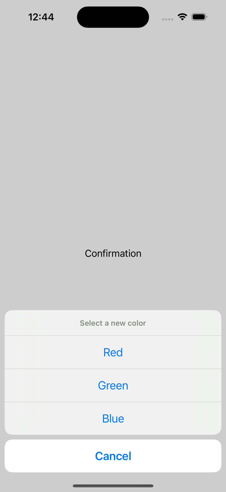
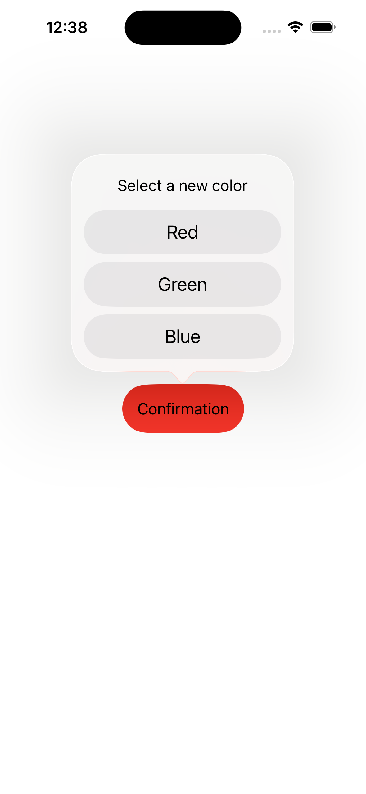
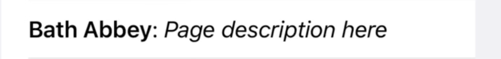

In June 2025 I started working thru [100 Days of SwiftUI](https://www.hackingwithswift.com/100/swiftui/). It's a great course, and I am truly impressed how much quality content & courses Paul Hudson is providing - and maintaining!! Paul, thank you sooo much for this! 🙏🏼

But it's a lot of content, so here are my notes - hopefully in a easy-to-navigate cheatsheet format. I have a rough structure in mind, but I will only fill in the content when I need it. So don't expect a complete overview!

[TOC]

## Swift

For an all in overview, see [Learn essential Swift in one hour](https://www.hackingwithswift.com/articles/242/learn-essential-swift-in-one-hour).

In the following chapter I have just added the parts I needed to check on at least once.

### `struct` & computed properties

```swift
struct Employee {
    let name: String
    var vacationAllocated = 14
    var vacationTaken = 0

    var vacationRemaining: Int {
        vacationAllocated - vacationTaken
    }
}
```

### Optionals

- Optionals let us represent the absence of data, which means we’re able to say “this integer has no value” – that’s different from a fixed number such as 0.
  - Example: `var str:String?` can hold a String or nil
- As a result, everything that isn’t optional definitely has a value inside, even if that’s just an empty string.
- Unwrapping an optional is the process of looking inside a box to see what it contains: if there’s a value inside it’s sent back for use, otherwise there will be nil inside.
- We can use `if let` to run some code if the optional has a value, or guard let to run some code if the optional doesn’t have a value – but with guard we must always exit the function afterwards.

```swift
func printSquare(of number: Int?) {
    guard let number = number else {
        print("Missing input")
        return
    }

    print("\(number) x \(number) is \(number * number)")
}
```

- The nil coalescing operator, ??, unwraps and returns an optional’s value, or uses a default value instead.

```swift
let new = captains["Serenity"] ?? "N/A"
```

- Optional chaining lets us read an optional inside another optional with a convenient syntax.
- If a function might throw errors, you can convert it into an optional using try? – you’ll either get back the function’s return value, or nil if an error is thrown.

### Protocols and Extensions

```swift
protocol Vehicle {
    func estimateTime(for distance: Int) -> Int
    func travel(distance: Int)
}
```

```swift
extension String {
    func trimmed() -> String {
        self.trimmingCharacters(in: .whitespacesAndNewlines)
    }
}
```

### Arrays & sorting

All arrays have built-in `sort()` and `sorted()` methods that can be used to sort the array.

- `sort()` sorts the array in-place
- `sorted()` returns a new, sorted array.

If the array is simple you can just call `sort()` directly, like this, to sort an array in place:

```swift
var names = ["Jemima", "Peter", "David", "Kelly", "Isabella"]
names.sort()
```

If you have more complex structs, you need to pass along the comparison:

```swift
struct User {
    var firstName: String
}

var users = [
    User(firstName: "Jemima"),
    User(firstName: "Peter"),
    User(firstName: "David"),
    User(firstName: "Kelly"),
    User(firstName: "Isabella")
]

users.sort {
    $0.firstName < $1.firstName
}
```

We can make our own types conform to `Comparable`, and when we do so we also get a `sorted()` method with no parameters. This takes two steps:

1. Add the `Comparable` conformance to the definition of User.
2. Add a method called `<` that takes two users and returns true if the first should be sorted before the second.

Here’s how that looks in code:

```swift
struct User: Identifiable, Comparable {
    let id = UUID()
    var firstName: String
    var lastName: String

    static func <(lhs: User, rhs: User) -> Bool {
        lhs.lastName < rhs.lastName
    }
}
```

### Strings

- They are special, and there is a lot to know...
- This doesn't work:

```swift
let name = "Paul"
let firstLetter = name[0]
```

### Dates

`Date`, `DateComponents`, and `DateFormatter`

### `enum`

`enum` are created like so:

```swift
enum Weekday {
    case monday, tuesday, wednesday, thursday, friday
}
```

A `switch` statement with `enum` looks like this:

```swift
switch loadingState {
case .loading:
    LoadingView()
case .success:
    SuccessView()
case .failed:
    FailedView()
}
```

## SwiftUI

- [Interactful](https://apps.apple.com/de/app/interactful/id1528095640?l=en-GB) is a nice tool to navigate and play around the different Views & components.
- [Human Interfaces Guideline](https://developer.apple.com/design/human-interface-guidelines/components)

### Views

- Everything is a view in SwiftUI 😜
- Running code when a view is shown, using `onAppear()`.

Even `ForEach` is a view, that's why we can write

```swift
ForEach(0..<5) {
    Text("Row \($0)")
}
```

Note: We can't write `ForEach(0..<5)`, because `ForEach`expects a `Range<Int>`, not a `ClosedRange<Int>`!

#### `ForEach` View

`ForEach` is a view, that is made up the sub-views created in every loop instance.

We typically use it to create sub-views based on a counter or an array.

`ForEach` with an array:

```swift
import SwiftUI

struct ContentView: View {
  let items = ["Apple", "Banana", "Cherry"]

  var body: some View {
    List {
      ForEach(items, id: \.self) { item in
        Text(item)
      }
    }
  }
}
```

### Data Entry

#### `TextField`

#### `Picker`

`Picker` is used to pick one out of many possible selections.

A regular picker looks like this:

```swift
Picker("Number of people", selection: $numberOfPeople) {
    ForEach(2 ..< 100 , id: \.self) {
        Text("\($0) people")
    }
}
```



A `Picker` can be modified with the `PickerStyle` modifier:

```swift
Picker("Tip percentage", selection: $tipPercentage) {
    ForEach(tipPercentages, id: \.self) {
        Text($0, format: .percent)
    }
}
.pickerStyle(.segmented)
```



#### `Stepper`


A stepper is a two-segment control that people use to increase or decrease an incremental value.

```swift
@State private var count: Int = 0

var body: some View {
    Stepper("\(count)",
        value: $count,
        in: 0...100
    )
}
```

- `DatePicker` for Dates. Using the `displayedComponents` parameter to control dates or times.
- `Form`
- `Picker`
- Navigation Bar

### Alerts & Confirmation Dialogs

#### Alerts

Alerts are an extension to a View with a Bool variable that decides on wether they are shown or not.

```swift
struct ContentView: View {
    @State private var showingAlert = false

    var body: some View {
        Button("Show Alert") {
            showingAlert = true
        }
        .alert("Important message", isPresented: $showingAlert) {
            Button("OK") { }
        }
    }
}
```

#### Confirmation Dialogues

Use them when many buttons / options are available. For example code check ou [this repo](https://github.com/tillg/100DaysOfSwiftUI/blob/main/16.5-AlertAndConfirmation/AlertAndConfirmation/AlertAndConfirmation/ContentView.swift).

**Note**: Pre-iOS 26 they slid in from the bottom, in iOS 26 they show up inside the screen.

Confirmation Dialog in iOS 18.5:


Confirmation Dialog in iOS 26:


### Text

`Text` is a Text field that describes text.

Note: Text fields with different styling can be _plused_ together to form one large text field with parts with different styling inside:

```swift
Text(page.title)
    .font(.headline)
+ Text(": ") +
Text("Page description here")
    .italic()
```

And you get a text with different stylings combined:



### Lists

Building scrolling tables of data using `List`, in particular how it can create rows directly from arrays of data.

```swift
List {
    Section {
        Label("Sun", systemImage: "sun.max")
        Label("Cloud", systemImage: "cloud")
        Label("Rain", systemImage: "cloud.rain")
    }
}
```

Buttons in Lists: When you place a button in a list, the ENTIRE list element become clickable! If there are more than one button in a list, wherever you click on the list element, it clicks ALL the buttons one after the other!

To fix that and get the behaviour we want, use `.buttonStyle(.plain)`

Same is true for HStack:

```swift
HStack {
    if label.isEmpty == false {
        Text(label)
    }

    ForEach(1..<maximumRating + 1, id: \.self) { number in
        Button {
            rating = number
        } label: {
            image(for: number)
                .foregroundStyle(number > rating ? offColor : onColor)
        }
    }
}
.buttonStyle(.plain)
```

### Images

```swift
struct ContentView: View
{
var body: some View {
Image (example)
    .resizable ()
    .scaledToFit ()
    .frame(width: 300, height: 300)}
}
```


Replace `ScaledToFit` by `ScaledToFill` and get


```swift
struct ContentView: View {
    var body: some View {
        Image (•example)
            .resizable ()
            .scaledToFit()
            .containerRelativeFrame(horizontal) { size, axis in
            size * 0.8
            ｝
    }
}
```


### Toolbar

### Bundle

Reading files from our app bundle by looking up their path using the `Bundle` class, including loading strings from there.

### Animations

Covered in [Day 32-34](https://www.hackingwithswift.com/100/swiftui/32). TODO I need to watch the clips again to extract my notes/cheatsheet.

- Creating animations implicitly using the `animation()` modifier.
- Customizing animations with delays and repeats, and choosing between ease-in-ease-out vs spring animations.
- Attaching the animation() modifier to bindings, so we can animate changes directly from UI controls.
- Using `withAnimation()` to create explicit animations.
- Attaching multiple `animation()` modifiers to a single view so that we can control the animation stack.

### Loading Data

If it's synchronous:

```swift
View...
    .onAppear(loadIt)
```

?? How is it done, when `loadIt` is async??

### Passing & returning values to/from views

As seen in [Selecting and editing map annotations](https://www.hackingwithswift.com/books/ios-swiftui/selecting-and-editing-map-annotations)

Imagine I have a View that is opened as Sheet and gets in a `Location` (being a self defined `struct`):

```swift
struct EditView: View {
    @Environment(\.dismiss) var dismiss
    var location: Location

    @State private var name: String
    @State private var description: String

    var body: some View {
        NavigationStack {
            Form {
                Section {
                    TextField("Place name", text: $name)
                    TextField("Description", text: $description)
                }
            }
            .navigationTitle("Place details")
            .toolbar {
                Button("Save") {
                    dismiss()
                }
            }
        }
    }
}
```

To pass in the `Location` I make an extra initializer:

```swift
init(location: Location) {
    self.location = location

    _name = State(initialValue: location.name)
    _description = State(initialValue: location.description)
}
```

Tu _return_ data to the calling code, I pass in a method `onSave`. First create an additional var in my View struct:

```swift
var onSave: (Location) -> Void
```

and then extend the initializer like so:

```swift
init(location: Location, onSave: @escaping (Location) -> Void) {
    self.location = location
    self.onSave = onSave

    _name = State(initialValue: location.name)
    _description = State(initialValue: location.description)
}
```

That `@escaping` part is important, and means the function is being stashed away for user later on, rather than being called immediately, and it’s needed here because the `onSave` function will get called only when the user presses Save.

### `Sheet`s & `NavigationStack`s

To open a view as sheet:

```swift
struct ContentView: View {
    @State private var showingAddExpense = false

    var body: some View {
        NavigationStack {
            VStack {
                // Some code here
            }
            .navigationTitle("iExpense")
            .toolbar {
                Button("Add Expense", systemImage: "plus") {
                    showingAddExpense = true
                }
            }
            .sheet(isPresented: $showingAddExpense) {
                AddView(expenses: expenses)
            }
        }
    }
}

```

## Networking

This is how you send something to an HTTPS Endpoint:

```swift
 func placeOrder() async {
        guard let encoded = try? JSONEncoder().encode(order) else {
            print("Failed to encode order")
            return
        }

        let url = URL(string: "https://reqres.in/api/cupcakes")!
        var request = URLRequest(url: url)
        request.setValue("application/json", forHTTPHeaderField: "Content-Type")
        request.httpMethod = "POST"

        do {
            let (data, other) = try await URLSession.shared.upload(for: request, from: encoded)

            let decodedOrder = try JSONDecoder().decode(Order.self, from: data)
            confirmationMessage = "Your order for \(decodedOrder.quantity)x \(Order.types[decodedOrder.type].lowercased()) cupcakes is on its way!"
            showingConfirmation = true
        } catch {
            print("Check out failed: \(error.localizedDescription)")
        }
    }
```

## Saving Data

I know 3 ways to save data in Swift/UI:

- UserDefaults: Best used to save small data quantities. For example App Settings.
- Writing it to the documents directory
- SwiftData

### Writing & reading to UserDefaults

We need a couple of things:

1. Our data has to be `Codable`, so that later we can create `JSONEncoder`
2. UserDefaults to save and load our data
3. A custom initializer for the data class, so it automatically loads
4. A `didSet` to the data, so whenever data is added or changed it gets automagically saved.

Making the data `Codable` most often is not too hard: As long as the components are `Codable`, the entire class is also.

This is what saving the data in a `didSet` can look like:

```swift
var items = [ExpenseItem]() {
    didSet {
        if let encoded = try? JSONEncoder().encode(items) {
            UserDefaults.standard.set(encoded, forKey: "Items")
        }
    }
}
```

And this is how a initializer that loads the data could look like:

```swift
init() {
    if let savedItems = UserDefaults.standard.data(forKey: "Items") {
        if let decodedItems = try? JSONDecoder().decode([ExpenseItem].self, from: savedItems) {
            items = decodedItems
            return
        }
    }

    items = []
}
```

### Writing & reading to the documents directory

This is how we write:

```swift
let data = Data("Test Message".utf8)
let url = URL.documentsDirectory.appending(path: "message.txt")

do {
    try data.write(to: url, options: [.atomic, .completeFileProtection])
} catch {
    print(error.localizedDescription)
}
```

..and this is how we read:

```swift
let url = URL.documentsDirectory.appending(path: "message.txt")

do {
    let input = try String(contentsOf: url)
    print(input)
} catch {
    print(error.localizedDescription)
}
```

### SwiftData

The moving parts we have are

- The `Model`: This is the data structure. The object(s) and it's fields
- The `ModelContainer`: This is the persistent storage. Think of it like the file in which the data is written on the server.
- The `ModelContext`: That's the in-memory kept version of your data and where the data modifications are held before being saved to the `ModelContainer`.

To enable your software to use SwiftData, make a model first:

```swift
import Foundation
import SwiftData

@Model
class Book {  // Models HAVE TO BE Classes!
    var title: String
    var author: String
    var genre: String
    var review: String
    var rating: Int
}
```

Add the `modelContainer` at App level

```swift

import SwiftData
import SwiftUI

@main
struct BookwormApp: App {
    var body: some Scene {
        WindowGroup {
            ContentView()
        }
        .modelContainer(for: Book.self)
    }
}
```

Use the data in your view:

```swift
struct ContentView: View {
    @Environment(\.modelContext) var modelContext
    @Query(sort: [
        SortDescriptor(\Book.title),
        SortDescriptor(\Book.author)
    ]) var books: [Book]
    ...
```

Pass a SwiftData object to a down stream View:

```swift
struct DetailView: View {
    @Environment(\.modelContext) var modelContext

    let book: Book
    ...
```

Add a SwiftData object:

```swift

struct AddBookView: View {
    @Environment(\.modelContext) var modelContext
    var body: some View {
        NavigationStack {
            Form {
                // Data entry here
                Section {
                    Button("Save") {
                        let newBook = Book(title: title, author: author, genre: genre, review: review, rating: rating)
                        modelContext.insert(newBook)
                        dismiss()
                    }
                }
            }
            .navigationTitle("Add Book")
        }
    }
}
```

Delete a SwiftData object:

```swift
    func deleteBook() {
        modelContext.delete(book)
        dismiss()
    }
```

Adding a context and sample data for `#Preview`:

```swift
#Preview {
    do {
        let config = ModelConfiguration(isStoredInMemoryOnly: true)
        let container = try ModelContainer(for: Book.self, configurations: config)
        let example = Book(title: "Test Book", author: "Test Author", genre: "Fantasy", review: "This was a great book; I really enjoyed it.", rating: 4)

        return DetailView(book: example)
            .modelContainer(container)
    } catch {
        return Text("Failed to create preview: \(error.localizedDescription)")
    }
}
```

## Core Image (Image Filters)

It's tricky... Look at the class explaining it [here](https://www.hackingwithswift.com/books/ios-swiftui/basic-image-filtering-using-core-image)

### TODO

- Explain the different classes / objects there are, what functionality is provided by which one, and how to transistion from one to the other: SwiftUI.Image - CGImage - CIImage
- Explain the context & filter concept.
- Give example

## MapKit

- [Maps Video](https://www.hackingwithswift.com/books/ios-swiftui/integrating-mapkit-with-swiftui)
- `import MapKit`
- `Map()` shows a map ;)
- `.mapStyle(.imagery)` or `.hybrid` or `.mapStyle(.hybrid(elevation: .realistic))`
- _Entering_ locations as `MapCameraPosition`:

```swift
let startPosition = MapCameraPosition.region(
    MKCoordinateRegion(
        center: CLLocationCoordinate2D(latitude: 56, longitude: -3),
        span: MKCoordinateSpan(latitudeDelta: 10, longitudeDelta: 10)
    )
)
```

- Getting Map taps as coordinates with `MapReader`, i.e. calculation from Screen Coordinates --> Long/Lat

```swift
MapReader { proxy in
    Map(initialPosition: startPosition)
        .onTapGesture { position in
            if let coordinate = proxy.convert(position, from: .local) {
                print("Tapped at \(coordinate)")
            }
        }
}
```

- Have `Marker` on maps

## Other topics

- Machine Learning
- Crashing your code with `fatalError()`, and why that might actually be a good thing.
- How to check whether a string is spelled correctly, using `UITextChecker` (it's a messy beast).
- Using `DragGesture()` to let the user move views around, then snapping them back to their original location.
- Bundles: How to put a file `whatever.txt` in your bundle, how to access (i.e. read it). File names need to be unique throughout a bundle.

## Questions & Todos

- What are the differences between a `Form` and a `VStack` ?
- Multi screen setups: `Sheet` and `NavigationStack`, and how to move around
  - `NavigationStack(path)`
- Binding: `@State`, `@Bindable`, `@Binding`
- How to pass data around multi screen setups
- TODO: Understand differnece in behaviour and look of Alert and Confirmation Dialogue.
