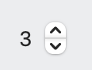
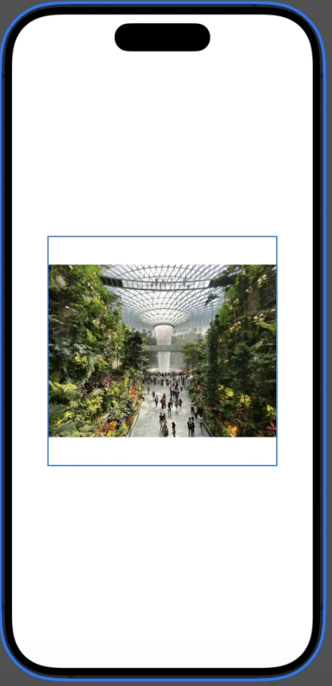
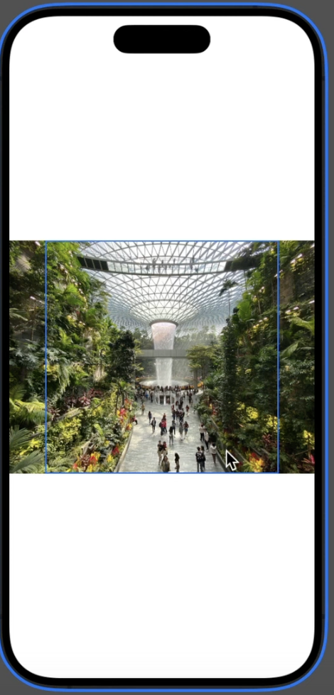

In June 2025 I started working thru [100 Days of SwiftUI](https://www.hackingwithswift.com/100/swiftui/). It's a great course, and I am truly impressed how much quality content & courses Paul Hudson is providing - and maintaining!! Paul, thank you sooo much for this! 🙏🏼

But it's a lot of content, so here are my notes - hopefully in a easy-to-navigate cheatsheet format. I have a rough structure in mind, but I will only fill in the content when I need it. So don't expect a complete overview!

[TOC]

## Swift

### Optionals

- Optionals let us represent the absence of data, which means we’re able to say “this integer has no value” – that’s different from a fixed number such as 0.
  - Example: `var str:String?` can hold a String or nil
- As a result, everything that isn’t optional definitely has a value inside, even if that’s just an empty string.
- Unwrapping an optional is the process of looking inside a box to see what it contains: if there’s a value inside it’s sent back for use, otherwise there will be nil inside.
- We can use if let to run some code if the optional has a value, or guard let to run some code if the optional doesn’t have a value – but with guard we must always exit the function afterwards.
- The nil coalescing operator, ??, unwraps and returns an optional’s value, or uses a default value instead.
- Optional chaining lets us read an optional inside another optional with a convenient syntax.
- If a function might throw errors, you can convert it into an optional using try? – you’ll either get back the function’s return value, or nil if an error is thrown.

### Protocols and Extensions

```swift
protocol Vehicle {
    func estimateTime(for distance: Int) -> Int
    func travel(distance: Int)
}
```

```swift
extension String {
    func trimmed() -> String {
        self.trimmingCharacters(in: .whitespacesAndNewlines)
    }
}
```

### Strings

- They are special, and there is a lot to know...
- This doesn't work:

```swift
let name = "Paul"
let firstLetter = name[0]
```

### Dates

`Date`, `DateComponents`, and `DateFormatter`

## SwiftUI

- [Interactful](https://apps.apple.com/de/app/interactful/id1528095640?l=en-GB)
- [Human Interfaces Guideline](https://developer.apple.com/design/human-interface-guidelines/components)

### Views

- Everything is a view in SwiftUI 😜
- Running code when a view is shown, using `onAppear()`.

Even `ForEach` is a view, that's why we can write

```swift
ForEach(0..<5) {
    Text("Row \($0)")
}
```

Note: We can't write `ForEach(0..<5)`, because `ForEach`expects a `Range<Int>`, not a `ClosedRange<Int>`!

#### `ForEach` View

`FotEach` is a view, that is made up the sub-views created in every loop instance.

We typically use it to create sub-views based on a counter or an array.

`ForEach` with an array:

```swift
import SwiftUI

struct ContentView: View {
  let items = ["Apple", "Banana", "Cherry"]

  var body: some View {
    List {
      ForEach(items, id: \.self) { item in
        Text(item)
      }
    }
  }
}
```

### Data Entry

#### `Stepper`


A stepper is a two-segment control that people use to increase or decrease an incremental value.

```swift
@State private var count: Int = 0

var body: some View {
    Stepper("\(count)",
        value: $count,
        in: 0...100
    )
}
```

- `DatePicker` for Dates. Using the `displayedComponents` parameter to control dates or times.
- `Form`
- `Picker`
- Navigation Bar
-

### Lists

Building scrolling tables of data using `List`, in particular how it can create rows directly from arrays of data.

### Images

```swift
struct ContentView: View
{
var body: some View {
Image (example)
    .resizable ()
    .scaledToFit ()
    .frame(width: 300, height: 300)}
}
```



Replace `ScaledToFit` by `ScaledToFill` and get



```swift
struct ContentView: View {
    var body: some View {
        Image (•example)
            .resizable ()
            .scaledToFit()
            .containerRelativeFrame(horizontal) { size, axis in
            size * 0.8
            ｝
    }
}
```


### Toolbar

### Bundle

Reading files from our app bundle by looking up their path using the `Bundle` class, including loading strings from there.

### Animations

Covered in [Day 32-34](https://www.hackingwithswift.com/100/swiftui/32). TODO I need to watch the clips again to extract my notes/cheatsheet.

- Creating animations implicitly using the `animation()` modifier.
- Customizing animations with delays and repeats, and choosing between ease-in-ease-out vs spring animations.
- Attaching the animation() modifier to bindings, so we can animate changes directly from UI controls.
- Using `withAnimation()` to create explicit animations.
- Attaching multiple `animation()` modifiers to a single view so that we can control the animation stack.

### Other topics

- Machine Learning
- Crashing your code with `fatalError()`, and why that might actually be a good thing.
- How to check whether a string is spelled correctly, using `UITextChecker` (it's a messy beast).
- Using `DragGesture()` to let the user move views around, then snapping them back to their original location.
- Bundles: How to put a file `whatever.txt` in your bundle, how to access (i.e. read it). File names need to be unique throughout a bundle.

## Questions

- What are the differences between a `Form` and a `VStack` ?
