**Note**: The github repo that goes with this article is [here](https://github.com/tillg/SwiftDataOniCloud).

As I have been learning Swift & SwiftUI and started using it, I often struggled when trying to use CloudKit. Too often... This is a minimal setup I used to remind future me of how I set up things and document my learnings.

- [Starting point](#starting-point)
- [Step by step](#step-by-step)
  - [Add Capabilities to Xcode project](#add-capabilities-to-xcode-project)
  - [Make model CloudKit ready](#make-model-cloudkit-ready)
- [Investigating, Testing, Playing around, maybe understanding...](#investigating-testing-playing-around-maybe-understanding)
  - [CloudKit Console](#cloudkit-console)
    - [Querying data](#querying-data)
  - [Syncing in real time](#syncing-in-real-time)
- [Reading](#reading)
  - [Apple](#apple)
- [Frequent errors](#frequent-errors)
  - [Default values for fields](#default-values-for-fields)
  - [Not signed in with AppleId](#not-signed-in-with-appleid)
  - [Entitlements was modified during the build](#entitlements-was-modified-during-the-build)
  - [Unable to initialize without an iCloud account (CKAccountStatusNoAccount).](#unable-to-initialize-without-an-icloud-account-ckaccountstatusnoaccount)

## Starting point

Almost all I know about SiftUI comes from the great tutorial [100 Days of SwiftUI](https://www.hackingwithswift.com/100/swiftui) from Paul Hudson. He does a fantastic job explaining SwiftUI, and offers this well-maintained course for free.

In order not having to start completely from scratch, I use the lesson from the course that introduces SwiftData: On [Day 53](https://www.hackingwithswift.com/100/swiftui/53) Paul starts a new project called _Bookworm_ that uses SwiftData to store it's book data. At the end of [Day 55](https://www.hackingwithswift.com/100/swiftui/55) he has built out a cute little application that stores it's data in SwiftData. In case you are not fluent in SwiftData or don't remember it, I strongly recommend watching the videos of those 3 days. His App uses SwiftData, but not in the cloud, just locally on device.

I will use this as the starting point to add iCloud syncing to it. You can find the _Bookworm_ app in [Paul Hudson's Github project](https://github.com/twostraws/HackingWithSwift): It's under [SwiftUI > project 11](https://github.com/twostraws/HackingWithSwift/tree/main/SwiftUI/project11).

If you clone / copy the _project 11_ directory and open it with Xcode you have to set your Team & Bundle Identifier to run it.

Now we will try to add iCloud syncing to it.

## Step by step

### Add Capabilities to Xcode project

In order to use CloudKit for syncing, we have to add 2 capabilities:

- CloudKit (duuh)
- Notification: This is needed so the device can get the signals that data changed and needs to be synced with the cloud again.

If you open you `Xcode > Project: MiniSwiftData > Target: MiniSwiftData > Signing & Capabilities` this is what you should see:

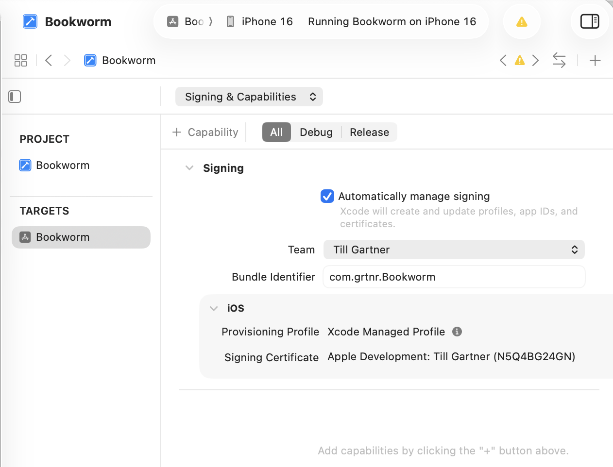

Click on the `+ Capability` button on the top left and search for iCloud:

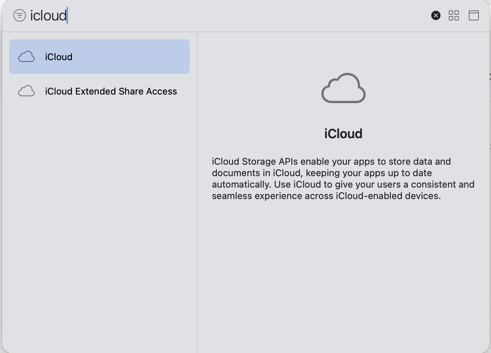

Then in the `iCloud` section select CloudKit as Service:

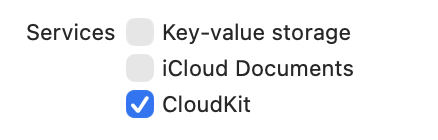

Then below we need a container. Click on `+` and enter a name. The usual name would be to the bundle Identifier, in my case that is `com.grtnr.Bookworm` (I just copy & paste it from the _Bundle Identifier_ field).

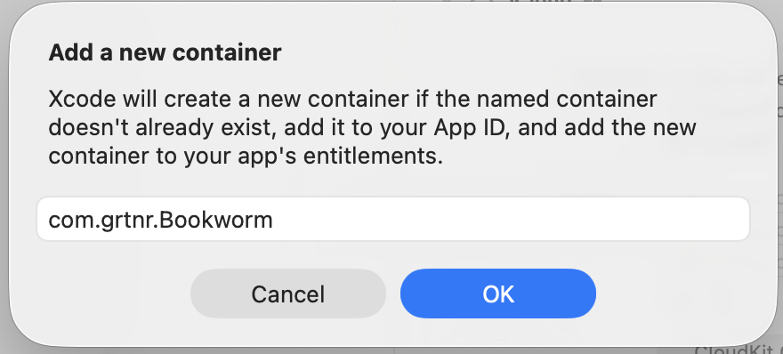

That leads to this:

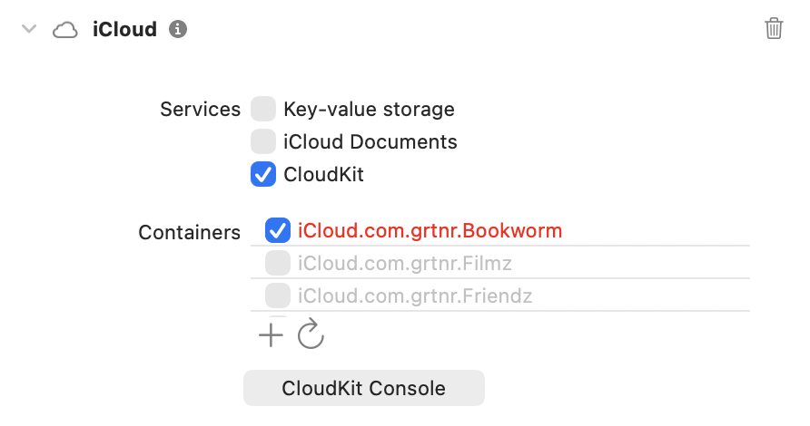

It's red because it has not been created yet, that simply takes some time.

In order to keep devices synced, iCloud uses the _Remote Push Notification_, so we have to add this service as well. Click on `+ Capability` again and search for _Back..._:

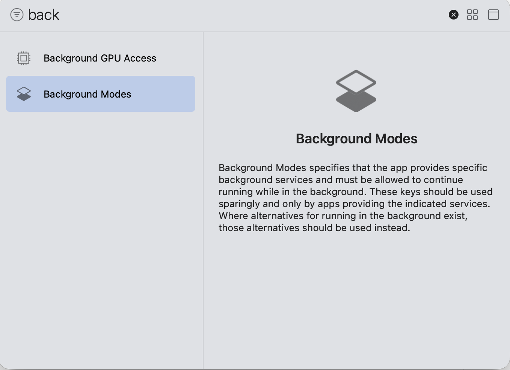

Then in the list of services of the _Background Modes_ section select _Remote notificatons_:

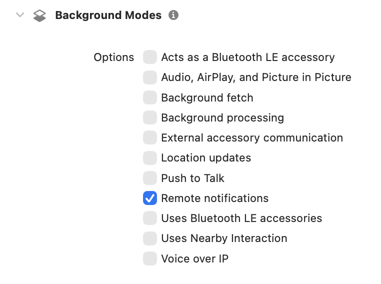

**Note**: Probably by now the container name has turned from red to black as it has been created in iCloud.

### Make model CloudKit ready

When starting the app now we get an error similar to this:

```bash
CoreData: error: Store failed to load.  <NSPersistentStoreDescription: 0x600000c0e670> (type: SQLite, url: file:///Users/tgartner/Library/Developer/CoreSimulator/Devices/1464DFC4-EE76-43DB-B178-C33F1FA97A91/data/Containers/Data/Application/34DEE59B-975D-4784-8A87-DC38A9D9DA37/Library/Application%20Support/default.store) with error = Error Domain=NSCocoaErrorDomain Code=134060 "A Core Data error occurred." UserInfo={NSLocalizedFailureReason=CloudKit integration requires that all attributes be optional, or have a default value set. The following attributes are marked non-optional but do not have a default value:
Book: author
Book: genre
Book: rating
Book: review
Book: title} with userInfo {
    NSLocalizedFailureReason = "CloudKit integration requires that all attributes be optional, or have a default value set. The following attributes are marked non-optional but do not have a default value:\nBook: author\nBook: genre\nBook: rating\nBook: review\nBook: title";
}
```

The reason is that a model needs to match a couple of restrictions
When creating models for using them with CloudKist we need to stick to some rules:

- Properties Default Values: Every property needs default value - unless it's optional.
- Can't Use `@Unique`

So I simply changed the `Book.swift` file:

```swift
import Foundation
import SwiftData

@Model
class Book {
    var title: String = ""
    var author: String = ""
    var genre: String = ""
    var review: String = ""
    var rating: Int = 3

    init(title: String, author: String, genre: String, review: String, rating: Int) {
        self.title = title
        self.author = author
        self.genre = genre
        self.review = review
        self.rating = rating
    }
}
```

Now I run the app on a Simulator, enter 3 books, run it on my real iPhone - et voilà, the books show up on my iPhone!! 🥰

## Investigating, Testing, Playing around, maybe understanding...

### CloudKit Console

When investigating what's happening there is a very helpful tool: The [CloudKit Console](https://icloud.developer.apple.com):

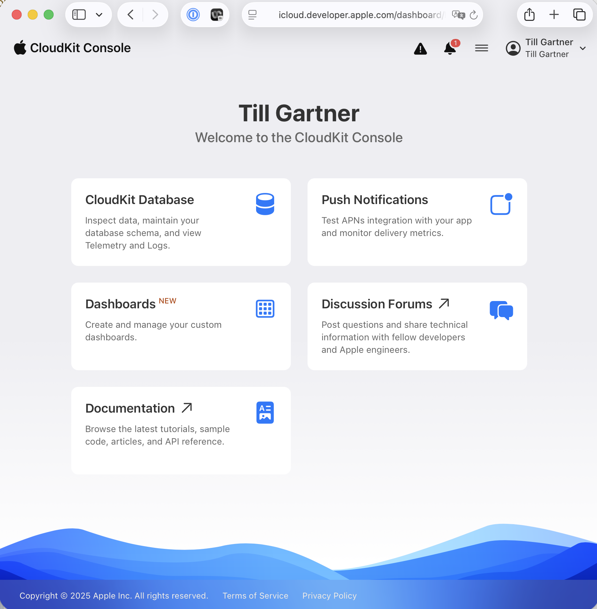

Select _CloudKit Database_ and then select the Bookworm database:

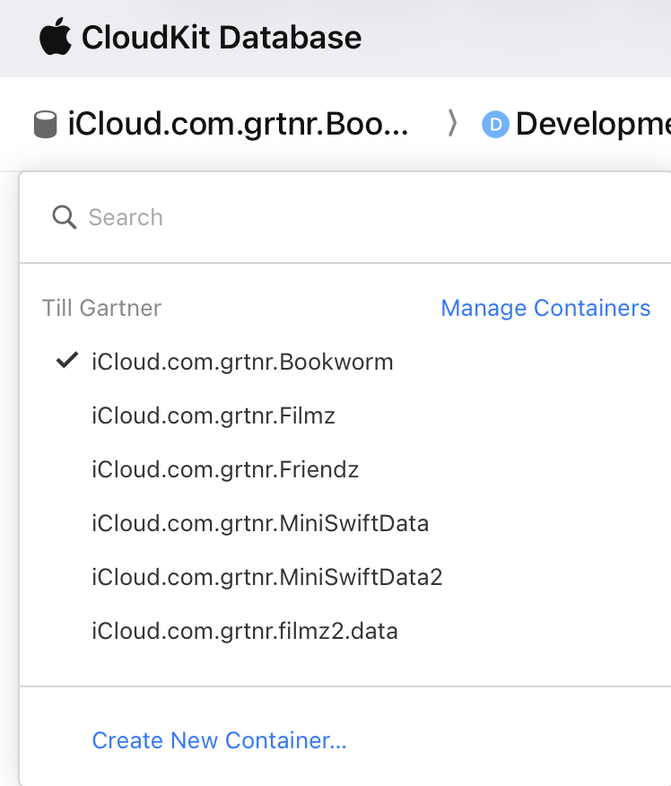

#### Querying data

To see what books have been created & saved, you need to select the proper options & filters

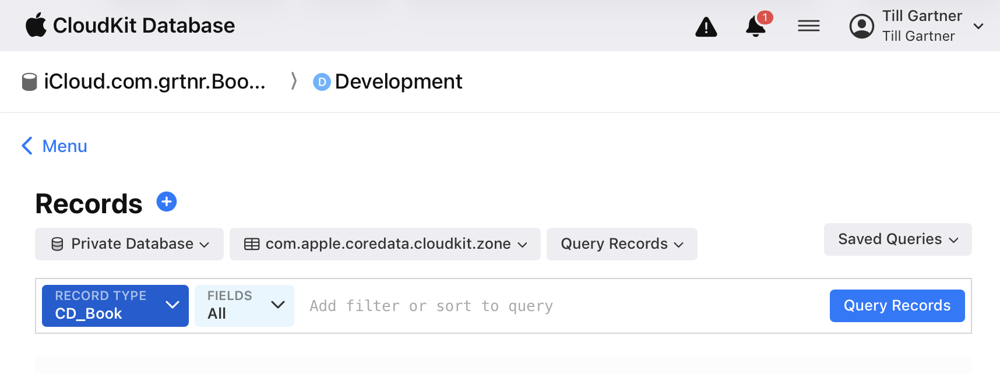

- Make sure at the top level you selected the Bookworm data base > Development
- Select **Private database**: That means we a per user separation of data
- In the zone drop down, do select the one that is not the \__default_, in my case that is **com.apple.coredata.cloudkit.zone**. I have no clue (yet) what those zones are about...
- In _RECORD TYPE_ select **CD_Book**, because we want to look at our books

Hit _Query Records_ and get an error... 😂


To fix this, select on the menu on the left side: Schema > Record Types and see this:

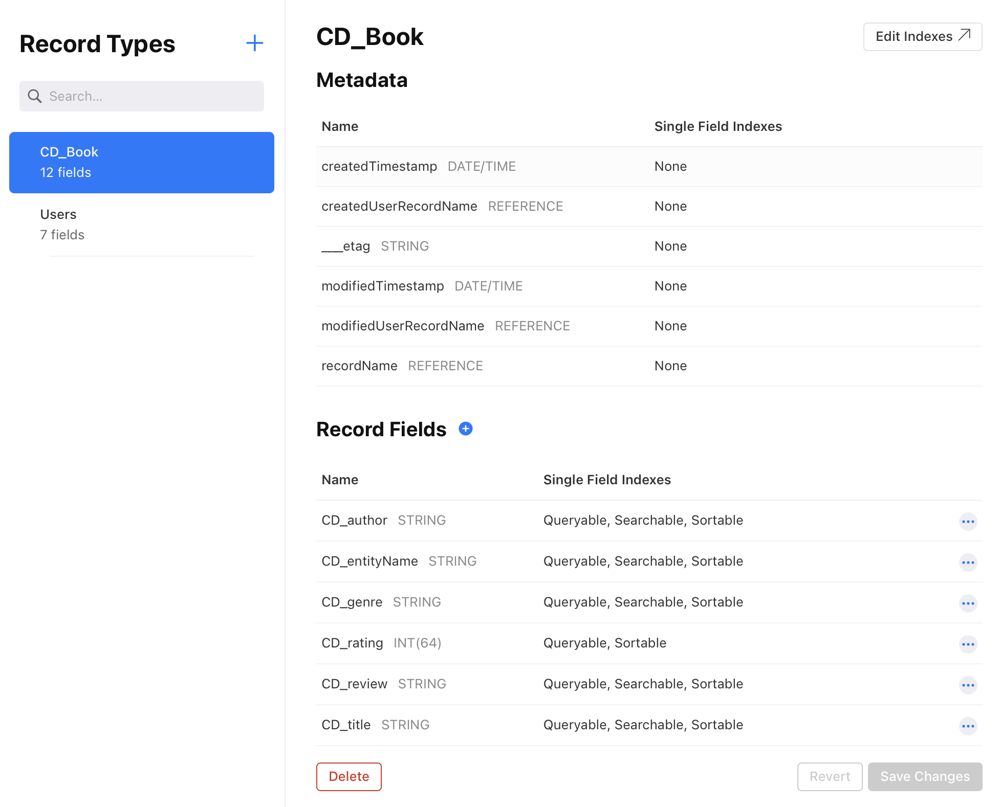

We see that he was right with his error message: `recordName`is not marked queryable. So let's fix that.

In the left Menu select Schema > Indexes and click on `+` to create a new index like so:

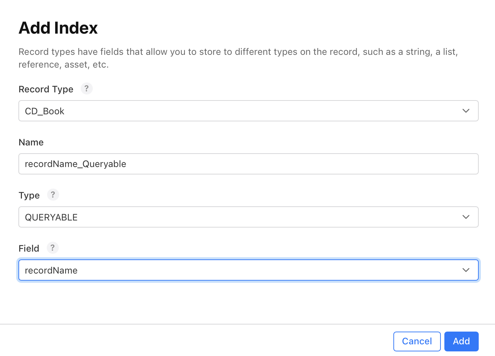

Return to the Data > Records, set your filters & switches: Private Database, zone `com.apple.coredata.cloudkit.zone`, RECORD TYPE to CD_Books and hit **Query Records** and Baammm:

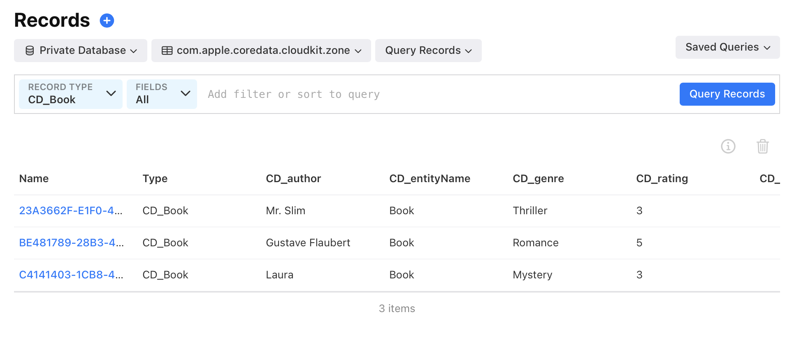

### Syncing in real time

One of the very coo,l features of CloudKit is the near-real-time-syncing: You modify data on one device, and the changes become visible on the other device very quickly - of course on devices that are logged in with the same AppleId.

The way that works is that a notification is sent to all devices that are logged in with that AppleId, and then they start a sync.

Unfortunately Simulators don't receive those notifications. So in order to test it, you have to make changes on a Simulator and then see them appear on your real device. Of course it also works if you use 2 physical devices.

## Reading

Some valuable documents and explanations I found.

### Apple

- [Enabling CloudKit in Your App](https://developer.apple.com/documentation/cloudkit/enabling-cloudkit-in-your-app): Explains how to configure your app to store data in iCloud using CloudKit.
- [Managing iCloud Containers with CloudKit Database App](https://developer.apple.com/documentation/cloudkit/managing-icloud-containers-with-cloudkit-database-app#//apple_ref/doc/uid/TP40014987-CH5): Explains how to investigate & see data in your containers via the Apple Web Dev.

- [TN3164: Debugging the synchronization of NSPersistentCloudKitContainer](https://developer.apple.com/documentation/technotes/tn3164-debugging-the-synchronization-of-nspersistentcloudkitcontainer): While trying to figure out why my App couldn't connect to it's container and kept reporting access problems, this is the key sentence from that techNote that saved me:

> If the portal shows that the association between your CloudKit container and app ID is correct, but the error still exists, it is most likely because the association isn’t synchronized to the CloudKit server. In that case, consider using a new CloudKit container to continue your development.

## Frequent errors

### Default values for fields

The fields of a model must have standard values so they can be saved in CloudKit. You don't need it for SwiftData if you just save the data locally on device.

### Not signed in with AppleId

### Entitlements was modified during the build

```error
Entitlements file "MiniSwiftData.entitlements" was modified during the build, which is not supported. You can disable this error by setting 'CODE_SIGN_ALLOW_ENTITLEMENTS_MODIFICATION' to 'YES', however this may cause the built product's code signature or provisioning profile to contain incorrect entitlements.
```

Of course i didn't change the entitlement right while Xcode was building. But the way to fix this is pretty easy:

- In Xcode go to _Project > Target > Signing & Capabilities_
- Unclick (deselect) _Automatically manage signing_
- Re-select it
- Select your _Team_

...that's it: Xcode now re-builds your entitlement file.

### Unable to initialize without an iCloud account (CKAccountStatusNoAccount).

If you are not logged in on your device or Simulator, iCloud sync can't work.

I saw this and was surpised, because I WAS logged into iCloud. BUT the iCloud access was switched off for the app:

_Settings > iCloud > Saved to iCloud | See All_. This is what the faulty guy looked like:

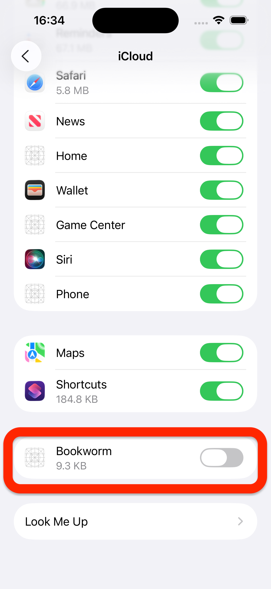
