# Remove Pelican

Replace Pelican with **garten**, a custom Python static site generator that uses the same underlying libraries (Jinja2, Python-Markdown, Pygments) but calls them directly in an explicit, debuggable pipeline.

## Goals

- Build our own site generator in Python
- Use the same Jinja2 templates as currently (minimal template changes)
- Transparent creation process: individual, debuggable phases with inspectable intermediate artifacts
- Each processing step is an individually callable Python module (testable in isolation)
- Keep using invoke tasks as the entry point
- Support incremental builds via file hashing

## Architecture

"Unbundle" Pelican into direct library calls. Pelican is essentially glue around **Jinja2** (templates), **Python-Markdown** (rendering), **feedgenerator** (Atom/RSS), **Pygments** (syntax highlighting). We already own the templates and all plugins - we just wire things together ourselves.

We replicate Pelican's template variable names exactly (e.g., `article.url`, `SITEURL`, `articles_page.object_list`) to avoid template changes during migration. Clean up variable names later as a separate step.

### Configuration

Site configuration uses a JSON file (`site.json`) replacing `pelicanconf.py`. Static settings live in JSON; dynamic/environment-specific values use environment variable overrides with a `GARTEN_` prefix.

**Layering (highest priority wins):**

1. Environment variables with `GARTEN_` prefix (e.g., `GARTEN_SITEURL=https://test.grtnr.com`)
2. `site.json` values

**Runtime values** like `BUILD_TIME` are computed by the config loader at startup, not stored in JSON.

```json
{
  "sitename": "grtnr.com",
  "author": "Till Gartner",
  "siteurl": "https://grtnr.com",
  "timezone": "Europe/Rome",
  "default_lang": "en",
  "theme_path": "pelicanyan",
  "content_path": "content",
  "output_path": "output",
  "article_paths": ["articles"],
  "page_paths": ["pages"],
  "recipe_paths": ["recipes"],
  "default_pagination": 10,
  "google_analytics": "G-H8M7YDCSD4",
  "translation": {
    "enabled": false,
    "target_languages": ["de", "fr"],
    "exclude_categories": ["recipes"],
    "exclude_paths": ["/pages/impressum/"]
  },
  "multilingual": {
    "enabled": true,
    "languages": ["en", "de", "fr"],
    "default_lang": "en"
  }
}
```

Environment overrides: `GARTEN_SITEURL`, `GARTEN_SITENAME`, `GARTEN_TRANSLATION__ENABLED` (double underscore for nested keys).

### Code organization

```text
grtnr.com_src/
├── garten/                 # Site generator package
│   ├── __init__.py
│   ├── discover.py         # Phase 1: content discovery
│   ├── translate.py        # Phase 2: AI translation
│   ├── process.py          # Phase 3: markdown → HTML
│   ├── assemble.py         # Phase 4: site structure
│   ├── render.py           # Phase 5: template rendering
│   ├── validate.py         # Phase 6: link checking
│   ├── models.py           # Content dataclasses
│   ├── config.py           # Config loader (reads site.json + env overrides)
│   └── utils.py            # Slug normalization, logging, date localization
├── extensions/             # Translation service package (kept as-is)
│   └── translation_service/
├── content/                # Unchanged
├── pelicanyan/templates/   # Unchanged (reused by garten)
├── plugins/                # OLD - Pelican plugins (removed after migration)
├── site.json               # Replaces pelicanconf.py
├── menu_translations.json
├── tag_translations.json
├── tasks.py                # Updated to call garten
├── .build/                 # Intermediate artifacts (gitignored)
└── output/                 # Final site output (gitignored)
```

During migration, both `plugins/` (old) and `garten/` coexist. After Increment 5, `plugins/` and `pelicanconf.py` are removed.

**Utility module mapping** (current plugins/ → garten/):

| Current utility module  | Not a Pelican plugin                                                  | Goes to                                                     |
| ----------------------- | --------------------------------------------------------------------- | ----------------------------------------------------------- |
| `logger_config.py`      | Logging infra, used by 11 files                                       | `garten/utils.py`                                           |
| `translation_utils.py`  | Hash caching, frontmatter parsing, used by `automatic_translation.py` | `garten/translate.py`                                       |
| `file_organization.py`  | Translation file management, used only by `tasks.py`                  | `garten/translate.py`                                       |
| `normalize_slugs.py`    | German character normalization                                        | `garten/utils.py`                                           |
| `markdown_wikilinks.py` | Markdown extension (not a signal-based plugin)                        | `garten/markdown_wikilinks.py` (kept as Markdown extension) |

## Data Models

Content dataclasses defined in `models.py`. Fields derived from actual frontmatter across all content files.

### Article

```python
@dataclass
class Article:
    # --- From frontmatter ---
    title: str                      # "How I Code with Claude" (or auto-generated from directory name)
    date: datetime                  # 2026-02-14
    tags: list[str]                 # ["code", "tech"]
    excerpt: str | None             # Short summary text
    image: str | None               # "claude.png" (filename relative to content dir)
    updates: str | None             # "2025-05-05" (last update date)
    status: str                     # "published" (default) or "hidden"

    # --- Derived during Discover ---
    slug: str                       # "how-i-code-with-claude" (normalized)
    category: str                   # From directory structure
    source_path: Path               # Absolute path to .md file
    content_dir: Path               # Directory containing the .md file
    content_type: str               # "article"

    # --- Set during Process ---
    content: str                    # Rendered HTML
    summary: str                    # Generated summary HTML

    # --- Set during Assemble ---
    url: str                        # "{slug}/"
    save_as: str                    # "{slug}/index.html"
    multilingual_urls: dict[str, str]  # {"en": "/slug/", "de": "/de/slug/", "fr": "/fr/slug/"}
    locale_date: str                # Localized date string for display
    translation_files: dict[str, Path] # {"de": Path("extensions/...-DE.md"), ...}
```

### Page

```python
@dataclass
class Page:
    # --- From frontmatter ---
    title: str                      # "About", "Impressum"
    date: datetime
    slug: str | None                # Optional explicit slug override
    status: str                     # "published" or "hidden"
    image: str | None

    # --- Derived during Discover ---
    source_path: Path
    content_dir: Path
    content_type: str               # "page"

    # --- Set during Process ---
    content: str                    # Rendered HTML

    # --- Set during Assemble ---
    url: str                        # "{slug}/"
    save_as: str                    # "{slug}/index.html"
    multilingual_urls: dict[str, str]
    locale_date: str
    translation_files: dict[str, Path]
```

### Recipe

```python
@dataclass
class Recipe:
    # --- From frontmatter ---
    title: str                      # "Käsekuchen", "Banh Xeo"
    layout: str                     # Always "recipe"
    slug: str | None                # Optional explicit slug
    date_published: datetime | None # ISO 8601 timestamp
    date_updated: datetime | None   # ISO 8601 timestamp
    date: datetime | None           # Simple date (alternative to date_published)
    image: str | None               # "hummus.jpg"
    excerpt: str | None             # "One of our favourite dishes in Vietnam"
    tags: list[str]                 # Present but typically empty

    # --- Derived during Discover ---
    source_path: Path
    content_dir: Path
    content_type: str               # "recipe"
    category: str                   # Always "recipes"

    # --- Set during Process ---
    content: str                    # Rendered HTML (includes ingredients + instructions)

    # --- Set during Assemble ---
    url: str                        # "recipes/{slug}/"
    save_as: str                    # "recipes/{slug}/index.html"
    multilingual_urls: dict[str, str]
    locale_date: str
```

Recipes have no structured ingredient/instruction metadata in frontmatter - all recipe structure lives in the markdown body and is rendered as HTML. This keeps the model simple.

### TranslatedContent

```python
@dataclass
class TranslatedContent:
    """A translated variant of any content type."""
    original: Article | Page | Recipe   # Reference to source content
    lang: str                           # "de", "fr"
    title: str                          # Translated title
    content: str                        # Translated HTML
    excerpt: str | None                 # Translated excerpt
    url: str                            # "/{lang}/{slug}/"
    save_as: str                        # "{lang}/{slug}/index.html"
    source_hash: str                    # Hash of original content
    translator: str                     # "gpt-4o-2024-08-06"
    translate_date: datetime
    locale_date: str                    # Date in target language
```

### Frontmatter notes

Field names are **case-insensitive** during parsing (both `Tags` and `tags` are accepted, normalized to lowercase). Both `excerpt` and `summary` map to the same field. The `date_published`/`date_updated` ISO timestamps (legacy JBake format) and simple `date` YYYY-MM-DD are both supported.

## Pipeline Design

Phase-based pipeline with sub-phases for fine-grained control. Each phase is its own Python module. Sub-phases are methods within that module.

```mermaid
graph TD
    subgraph "Phase 1: Discover"
        D1[1.1 Scan content directories]
        D2[1.2 Parse frontmatter]
        D3[1.3 Auto-title from directory names]
        D4[1.4 Assign categories from directory structure]
        D5[1.5 Find translation files in extensions/]
        D1 --> D2 --> D3 --> D4 --> D5
    end

    subgraph "Phase 2: Translate"
        T1[2.1 Hash source content]
        T2[2.2 Translate changed content]
        T3[2.3 Generate/update tag translations]
        T1 --> T2 --> T3
    end

    subgraph "Phase 3: Process"
        P1[3.1 Markdown → HTML<br/>includes WikiLinks extension]
        P2[3.2 Copy adjacent images]
        P3[3.3 Generate summaries from excerpts]
        P4[3.4 External link post-processing<br/>add target=_blank via BeautifulSoup]
        P5[3.5 Localize dates per language]
        P1 --> P2 --> P3 --> P4 --> P5
    end

    subgraph "Phase 4: Assemble"
        A1[4.1 Generate URLs for all content]
        A2[4.2 Generate language-prefixed URLs]
        A3[4.3 Prefix internal links with language codes]
        A4[4.4 Build tag + category groupings]
        A5[4.5 Build pagination]
        A6[4.6 Build menu with translations]
        A7[4.7 Build language switcher data]
        A8[4.8 Filter articles for index]
        A1 --> A2 --> A3 --> A4 --> A5 --> A6 --> A7 --> A8
    end

    subgraph "Phase 5: Render"
        R1[5.1 Render articles, pages, recipes]
        R2[5.2 Render index pages per language, paginated]
        R3[5.3 Render tag + category pages]
        R4[5.4 Render feeds RSS/Atom]
        R5[5.5 Render sitemap, robots.txt, humans.txt]
        R6[5.6 Render root redirect page]
        R7[5.7 Copy static assets + images to language dirs]
        R1 --> R2 --> R3 --> R4 --> R5 --> R6 --> R7
    end

    subgraph "Phase 6: Validate"
        V1[6.1 Link checking via lychee]
    end

    D5 --> T1
    T3 --> P1
    P5 --> A1
    A8 --> R1
    R7 --> V1
```



### Sub-phase ordering within Process (Phase 3)

The ordering within Process is critical due to dependencies:

1. **3.1 Markdown → HTML** - Runs Python-Markdown with all extensions (WikiLinks at priority 175, TOC, CodeHilite, Extra, Meta). WikiLinks are resolved here as a Markdown preprocessor.
2. **3.2 Copy adjacent images** - Finds images in content directories, copies to output, fixes relative URLs in the rendered HTML.
3. **3.3 Generate summaries** - Extracts/copies excerpt metadata to summary field.
4. **3.4 External link processing** - Post-processes the HTML with BeautifulSoup to add `target="_blank"` and `rel="noopener noreferrer"` to external links.
5. **3.5 Localize dates** - Translates month/weekday names per language (e.g., "February" → "Februar" / "février").

### Multilingual decomposition

The current `multilingual_site.py` (1,445 lines) is decomposed across phases:

| Logic group                                     | Lines in current plugin | Target phase   |
| ----------------------------------------------- | ----------------------- | -------------- |
| Find translation files                          | ~50 lines               | 1.5 Discover   |
| Parse translation frontmatter + markdown → HTML | ~270 lines              | 3.1 Process    |
| Date localization                               | ~30 lines               | 3.5 Process    |
| Generate language-prefixed URLs                 | ~50 lines               | 4.2 Assemble   |
| Prefix internal links with lang codes           | ~30 lines               | 4.3 Assemble   |
| Language switcher data                          | ~50 lines               | 4.7 Assemble   |
| Write per-language output files                 | ~250 lines              | 5.1-5.2 Render |
| Copy images to language dirs                    | ~60 lines               | 5.7 Render     |
| Root redirect page                              | ~15 lines               | 5.6 Render     |
| Context management / init                       | ~50 lines               | Config / utils |

### Intermediate artifacts

Each phase writes JSON artifacts to `.build/<phase>/`. This enables:

- Inspecting state between phases (debugging)
- Running/testing phases independently
- Incremental builds (skip phases when input hash unchanged)

```text
.build/
├── discover/
│   └── manifest.json     # All content with metadata
├── translate/
│   └── manifest.json     # Updated manifest with translation paths
├── process/
│   ├── manifest.json     # Manifest with HTML content references
│   └── html/             # Rendered HTML fragments per content item
├── assemble/
│   └── site.json         # Full site structure: tags, categories, pagination
└── hashes.json           # Input hashes for incremental build tracking
```

### Invoke tasks

- `inv build` - Run all phases
- `inv discover` - Run phase 1 only
- `inv translate` - Run phases 1-2
- `inv process` - Run phases 1-3
- `inv render` - Run phases 1-5
- `inv validate` - Run phase 6 on existing output

### Incremental builds

Use file content hashes to skip unchanged work. Each phase checks if its inputs have changed since the last run (tracked in `.build/hashes.json`). This replaces Pelican's flaky caching with something deterministic.

## Feature Inventory

| Feature                   | Current                                 | New approach                                  |
| ------------------------- | --------------------------------------- | --------------------------------------------- |
| Markdown → HTML           | Python-Markdown + extensions            | Same library, direct call                     |
| Jinja2 templates          | Via Pelican theme                       | Direct Jinja2 rendering                       |
| WikiLinks                 | Custom markdown extension + plugin      | Keep markdown extension, simplify plugin      |
| Content types             | Articles, Pages, Recipes (via plugin)   | Python dataclasses (see Data Models)          |
| Adjacent images           | copy_adjacent_images plugin             | Keep logic, run in sub-phase 3.2              |
| German slug normalization | normalize_slugs plugin                  | Reuse existing functions in `garten/utils.py` |
| Auto-title from directory | auto_title plugin                       | Keep logic in sub-phase 1.3                   |
| Category from directory   | set_proper_category plugin              | Keep logic in sub-phase 1.4                   |
| External link processing  | external_links plugin                   | HTML post-processing in sub-phase 3.4         |
| Summary/excerpt           | excerpt_to_summary plugin               | Sub-phase 3.3                                 |
| Homepage filtering        | filter_articles_for_index plugin        | Keep logic in sub-phase 4.8                   |
| Translation (AI)          | automatic_translation plugin            | Keep, run in sub-phase 2.2                    |
| Multilingual URLs         | multilingual_site plugin (1,445 lines)  | Decomposed across phases (see table above)    |
| Pagination                | Pelican built-in                        | Sub-phase 4.5                                 |
| Tag/category pages        | Pelican built-in                        | Sub-phases 4.4 + 5.3                          |
| Sitemap                   | Pelican direct template                 | Keep as template in sub-phase 5.5             |
| RSS/Atom feeds            | Pelican built-in                        | `feedgenerator` library in sub-phase 5.4      |
| Static files              | Pelican STATIC_PATHS                    | Simple file copy in sub-phase 5.7             |
| Dev server + livereload   | Pelican server + livereload             | Keep livereload, use `http.server`            |
| SEO tags                  | hreflang/canonical in templates         | Populated from multilingual URL map in 4.2    |
| Build timestamp           | `BUILD_TIME` variable in pelicanconf.py | Computed by config loader at startup          |
| Google Analytics          | Config variable in templates            | Pass config to templates                      |
| Typogrify                 | Pelican built-in                        | Use `typogrify` library directly              |
| Recipe content type       | recipes plugin + dedicated templates    | Dataclass + own templates (see Data Models)   |
| Date localization         | multilingual_site plugin                | Sub-phase 3.5 in `garten/utils.py`            |
| Language switcher         | multilingual_site plugin                | Sub-phase 4.7                                 |
| Root redirect page        | multilingual_site plugin                | Sub-phase 5.6                                 |

## Translation

### Content translation

- Translate all content: pages, articles, menu items, tag names
- Re-translate only when source content hash changes (existing caching approach)
- Configurable LLM provider: local LLM for dev, OpenAI/cloud for CI
- Reuse `extensions/translation_service/` package as-is, called from `garten/translate.py`

### Tag translation

Auto-generated by LLM on first encounter, stored in `tag_translations.json` (committed to git). When new tags appear, the LLM generates translations and the build logs a notice so the editor can review/adjust. Manual edits take precedence over auto-generated values.

### Menu translation

Simple `menu_translations.json` config file committed to git. With only 4 menu items × 3 languages = 12 entries, this is too small for LLM overhead. LLM generates the initial file, then it's manually maintained.

```json
{
  "en": {
    "Topics": "Topics",
    "Recipes": "Recipes",
    "About": "About",
    "Impressum": "Impressum"
  },
  "de": {
    "Topics": "Themen",
    "Recipes": "Rezepte",
    "About": "Über",
    "Impressum": "Impressum"
  },
  "fr": {
    "Topics": "Sujets",
    "Recipes": "Recettes",
    "About": "À propos",
    "Impressum": "Mentions légales"
  }
}
```

## Migration Strategy

Build `garten` alongside Pelican in increments, using HTML diff to verify correctness at each step before moving on.

### Increment 1: Discover

Build content discovery that produces a JSON manifest of all content (articles, pages, recipes) with metadata. Write a comparison test that runs both Pelican and garten's Discover phase and asserts they find the same content with the same metadata.

#### Increment 1 — Implementation Notes

**Status: DONE** — 41 tests passing, `inv discover` produces `.build/discover/manifest.json`.

**Decisions taken during implementation:**

1. **Date fallback chain:** frontmatter `date:` → directory name date prefix → file mtime. Pelican used `DEFAULT_DATE = "fs"` (filesystem). Garten prefers the directory name date prefix (more reliable across git clones where mtime isn't preserved).
2. **YYYY-MM directory prefix** (e.g., `2025-07-swiftui-cheatsheet`) is accepted alongside YYYY-MM-DD. The day defaults to 1.
3. **Markdown filename ≠ directory name** in 5 articles (e.g., `2012-04-10-indien-tag1/` contains `2012-04-10_indien_tag_1.md`). The discover phase finds any `.md` file in the directory, not just one matching the dir name.
4. **`type: post`** field found in some older articles is ignored — content type is determined by directory path (articles/, pages/, recipes/).
5. **`summary` and `excerpt`** both map to the `excerpt` field in the dataclass.
6. **Slug derivation for articles:** derived from the markdown filename (not directory name), with date prefix stripped, then normalized. This matches Pelican's `SLUGIFY_SOURCE = "title"` behaviour for articles that have titles, and falls back to filename-based slugs for those that don't.
7. **Frontmatter parser** is a simple `key: value` line parser (not full YAML). This matches the content's actual format and avoids YAML library dependencies. Keys are lowercased for case-insensitive matching (`Tags:` → `tags`).
8. **Comparison test** compares garten's `normalize_slug()` against Pelican's plugin implementation to verify slug compatibility.
9. **Tags are lowercased** during parsing (e.g., `Tags: Tech, AI` → `["tech", "ai"]`).
10. **`updates` field** is parsed from frontmatter but ignored for now (stored in the Article dataclass for future use).

**Files created:**

- `garten/__init__.py`, `garten/utils.py`, `garten/models.py`, `garten/config.py`, `garten/discover.py`
- `site.json` — config file replacing `pelicanconf.py`
- `tests/test_discover.py` — 41 tests (unit + integration + Pelican comparison)
- Updated `tasks.py` with `inv discover` task
- Updated `.gitignore` with `.build/`

**Content inventory:** 56 articles, 3 pages, 35 recipes.

### Increment 2: Process

Build markdown rendering + image copying + summaries. For each piece of content, diff the HTML output against Pelican's. This validates the core rendering pipeline.

#### Increment 2 — Implementation Notes

**Status: DONE** — 59 tests passing, `inv process` produces `.build/process/manifest.json` + individual HTML fragments.

**Decisions taken during implementation:**

1. **Typogrify included in Process phase.** Pelican applies `typogrify` to `article._content` (smart quotes, proper dashes, etc.). Garten applies it identically after markdown rendering + external link processing to match output. Applied unconditionally (matching `TYPOGRIFY = True` in pelicanconf.py). Config option deferred until needed.
2. **Image URL prefix uses `item["slug"]` for all content types**, matching the Pelican `copy_adjacent_images` plugin exactly. This means recipe image URLs use `/banh-xeo/image.jpg` rather than `/recipes/banh-xeo/image.jpg`. This appears to be a pre-existing bug in the Pelican plugin (images are copied to `output/recipes/{slug}/` but URLs reference `/{slug}/`). Matched for now; will fix in a later increment when we can verify against the live site.
3. **Image file copying deferred to Render phase (Phase 5).** Process only discovers adjacent files and fixes URLs in HTML. The actual `shutil.copy2` to output directories happens in Render, keeping Process focused on content transformation.
4. **Date localization (sub-phase 3.5) deferred to Increment 4** (Translation + Multilingual). Date localization is inherently language-dependent and belongs with the multilingual pipeline.
5. **WikiLinks extension ported to `garten/markdown_wikilinks.py`.** Identical logic to `plugins/markdown_wikilinks.py` but imports `normalize_slug` from `garten.utils` instead of via `sys.path` manipulation. Registered at priority 175 (same as Pelican version).
6. **Markdown extensions match pelicanconf.py exactly:** toc (permalink=False, anchorlink=False, toc_depth=3, marker=[TOC]), codehilite (css_class="highlight"), extra, meta, plus custom WikiLinks. Output format is html5.
7. **Frontmatter stripping reuses the same regex** from `discover.py` (`^---\s*\n(.*?)\n---\s*\n`). The body after stripping starts with content, so the `meta` markdown extension doesn't accidentally parse content lines as metadata.
8. **New markdown instance per document.** Python-Markdown maintains internal state (e.g., footnote counters, TOC data). A fresh `Markdown()` instance is created for each content item, matching Pelican's behaviour.
9. **Process manifest stores content by reference.** The `.build/process/manifest.json` replaces inline content with file paths (`html/articles/{slug}.html`) to keep the manifest readable. Full HTML is in the individual files.
10. **Summary generation is simple excerpt copy** (matching `excerpt_to_summary` plugin). Strips surrounding quotes. Only applied to articles (pages and recipes don't have summaries in the current templates).
11. **External link processing uses BeautifulSoup** (html.parser) to add `target="_blank"` and `rel="noopener noreferrer"` to all `http://` and `https://` links. Matches the Pelican `external_links` plugin exactly.
12. **Attachments directory supported.** Files in `{content_dir}/attachments/` are included in adjacent file discovery, matching the Pelican plugin's behaviour for PDF downloads and other non-image files.

**Files created:**

- `garten/process.py` — Process phase with all sub-phases (3.1–3.4)
- `garten/markdown_wikilinks.py` — Ported WikiLinks markdown extension
- `tests/test_process.py` — 59 tests (unit + integration + spot checks)
- Updated `tasks.py` with `inv process` task (runs discover + process)

**Test coverage:** 59 tests covering strip_frontmatter (4), markdown rendering (12), image URL fixing (8), adjacent file discovery (5), summary generation (6), external links (7), typogrify (2), integration on real content (11), and spot checks for specific features trty (4).

### Increment 3: Assemble + Render

Build tag/category grouping, pagination, and Jinja2 template rendering. Diff the full site output directory against Pelican's output. At this point we have a working (English-only) site generator.

#### Increment 3 — Implementation Notes

**Status: DONE** — 172 tests passing (41 discover + 59 process + 34 assemble + 38 render), `inv render` produces a complete English-only site in `output/`.

**Decisions taken during implementation:**

1. **English-only for Increment 3.** All multilingual features (language-prefixed URLs, language switcher data, translation content rendering, root redirect page, per-language index pages) are deferred to Increment 4. The output matches Pelican's English content output.
2. **Tag/Category/Author are simple classes with `__str__` and `.slug`.** Templates use `{{ tag }}` for display and `tag.slug` for URL generation. Tag equality and hashing are slug-based (so `Tag("tech")` and `Tag("Tech")` with the same slug are equal).
3. **Pagination uses `SimpleNamespace`** with `has_previous()` and `has_next()` as callables (lambdas), matching Pelican's pagination object interface. Page URLs: `index.html`, `index2.html`, ..., `indexN.html`.
4. **RecipeWrapper provides both direct attributes and `.metadata` namespace.** `recipe.html` accesses `recipe.title`, `recipe.content`, `recipe.image` directly. `recipe_preview.html` accesses `recipe.metadata.prep_time`, `recipe.metadata.image`, etc. Both are served from the same wrapper class using `SimpleNamespace` for metadata.
5. **SITEURL is empty string for dev** (via `relative_urls: true` in site.json), matching Pelican's `SITEURL = ""`. All template URLs are root-relative.
6. **locale_date uses `strftime("%B %-d, %Y")`** for English (e.g., "February 14, 2026"), matching `DATE_FORMATS["en"]` in pelicanconf.py. `%-d` is POSIX (no zero-padding), works on macOS/Linux.
7. **Articles sorted by date descending** (newest first) for index and archive pages.
8. **Recipe image URL bug fixed.** Increment 2 noted a pre-existing Pelican bug where recipe image URLs used `/{slug}/image.jpg` instead of `/recipes/{slug}/image.jpg`. Fixed in process.py by using content_type to determine URL prefix: `recipes/{slug}` for recipes, `{slug}` for everything else.
9. **Individual author page generated** at `author/{slug}.html` using the index template, matching Pelican's author page behavior. Only one author exists.
10. **Global template context matches Pelican variable names exactly:** `SITENAME`, `SITEURL`, `DESCRIPTION`, `SITEDESCRIPTION`, `DEFAULT_LANG`, `LANG`, `current_language`, `BUILD_TIME`, `GOOGLE_ANALYTICS`, `LINKS`, `DEFAULT_PAGINATION`, `MULTILINGUAL_ENABLED`, and all feed variables (None for dev).
11. **Jinja2 environment uses `trim_blocks=True` and `lstrip_blocks=True`** for clean HTML output. Templates are loaded from `pelicanyan/templates/` unchanged.
12. **Static file copying has two sources:** theme static (`pelicanyan/static/` → `output/theme/`) and content static (`content/static/` → `output/` with extra path metadata for favicon, apple-touch-icon). Adjacent images are copied per content item to their output directory.
13. **`site.json` extended** with `links`, `relative_urls`, `categories_in_index`, and `date_formats` keys. Links use arrays-of-arrays format (JSON doesn't have tuples).
14. **Link validation: 1 pre-existing error** in content (WikiLink to non-existent `/todo/` page in About page). All other links (2,792 total) pass validation.

**Files created:**

- `garten/assemble.py` — Assemble phase with Tag/Category/Author classes, URL generation, locale dates, tag/category groupings, pagination, article filtering
- `garten/render.py` — Render phase with ArticleWrapper/PageWrapper/RecipeWrapper, Jinja2 rendering for all template types, static file and image copying
- `tests/test_assemble.py` — 34 tests (Tag/Category/Author classes, URL generation, locale dates, tag map, category map, pagination, filtering, sorting, integration on real content)
- `tests/test_render.py` — 38 tests (wrapper objects, global context, Jinja2 env, static copying, full integration rendering)
- Updated `tasks.py` with `inv assemble` and `inv render` tasks
- Updated `site.json` with links, relative_urls, date_formats, categories_in_index
- Updated `garten/process.py` — fixed recipe image URL prefix

**Output inventory:** 118 HTML files, 6 paginated index pages, 56 article pages, 2 page pages, 35 recipe pages, 13 tag pages, 1 category page, 258 image files, plus sitemap.xml, robots.txt, humans.txt, archives.html, authors.html, categories.html, recipes/index.html.

### Increment 4: Translation + Multilingual

Port the translation and multilingual URL systems to garten. Verify translated output matches.

#### Increment 4 — Implementation Notes

**Status: DONE** — 212 tests passing (73 process + 84 assemble + 55 render), `inv render` produces a complete multilingual site with en/de/fr language variants.

**Scope:** Ported the multilingual site generation from `plugins/multilingual_site.py` (1,446 lines) into garten's existing phase modules. No new modules created — all multilingual logic lives in process.py, assemble.py, render.py, and utils.py.

**Decisions taken during implementation:**

1. **Date localization in `utils.py`, not a separate module.** `localize_date()` accepts a datetime or ISO string and language code, returning locale-formatted strings: English "February 14, 2026", German "Mi 14. Feb 2026", French "vendredi 14 février 2026". Month/weekday lookup tables for en/de/fr are in `_LANG_DATE_CONFIG`. Unknown languages fall back to English format.
2. **Translation processing added to Phase 3 (Process) as sub-phase 3.5.** Translation files are read, their frontmatter parsed, and content rendered through the same pipeline as original content (markdown → HTML → image URL fixing → external links → typogrify). Results stored in `item["translations"]` dict keyed by language code.
3. **Translation frontmatter parser is intentionally simple** — same line-by-line `key: value` approach as discover.py, not full YAML. Handles quoted values (single and double quotes stripped). Keys are lowercased for case-insensitive matching.
4. **English articles rendered at root (`/{slug}/`) AND at `/en/{slug}/`.** Root-level English content provides canonical URLs and backwards compatibility. Per-language copies (including English) provide the multilingual URL structure. This matches the Pelican multilingual plugin's behavior.
5. **Root `index.html` is auto-redirect when multilingual enabled.** Instead of a paginated article list at root, `index.html` renders `auto_redirect.html` which detects browser language and redirects to `/{lang}/`. Paginated indexes move to `/{lang}/index.html`, `/{lang}/index2.html`, etc.
6. **Per-language content uses `copy.copy()` (shallow copy) of original dicts.** `translations` and `translation_files` keys are popped from copies so they don't carry over to language-specific items. This avoids deep-copying large HTML content strings unnecessarily.
7. **Internal link prefixing skips known prefixes:** `/theme/`, `/static/`, `/favicon`, and already-language-prefixed links. English content is never prefixed (it lives at root). Only non-English language copies get `href="/de/..."` prefixes.
8. **Recipes are NOT translated** — they exist at root level only (`/recipes/{slug}/`), not under language directories. This matches the existing `TRANSLATION_EXCLUDE_CATEGORIES = ["recipes"]` config.
9. **`build_per_language_content()` produces independent data structures per language:** articles, pages, tag_map, pagination, index_articles. Each language gets its own tag groupings and pagination, ensuring proper article counts and page numbers per language.
10. **Menu translations loaded from `menu_translations.json`** (5 entries × 3 languages). `build_translated_links()` translates menu titles and prefixes hrefs for non-English languages. Created `menu_translations.json` with en/de/fr for Home, Topics, Recipes, About, Impressum.
11. **hreflang tags generated per article/page** via `generate_multilingual_urls()`. Sets `multilingual_urls` dict mapping each language to its URL. Templates render `<link rel="alternate" hreflang="..." href="..."/>` from this data.
12. **Language switcher data** (`language_links`) provides `[{code, name, url}]` for non-default languages. Used by the globe button + dropdown in the sidebar template.
13. **Images are copied to all language directories.** `copy_images_for_language()` copies images from original content directories to each language's output directory (e.g., `output/de/how-i-code-with-claude/claude.png`). Total: 234 images × 3 languages = 702 image copies for language dirs, plus 255 at root.
14. **Per-language tag/tags pages** at `/{lang}/tag/{slug}/index.html` and `/{lang}/tags/index.html`. Each language gets its own tag groupings.
15. **Template context extended** with `LANG`, `current_language`, and translated `LINKS` per language. Templates already supported these variables from the Pelican multilingual plugin.
16. **`ArticleWrapper` now populates** `translation`, `translator`, `original_url`, and `language_links` from the data dict (were hardcoded to empty defaults in Increment 3).
17. **Existing Increment 3 tests updated** to account for multilingual changes: `test_write_artifacts` now counts translation HTML files, `test_index_pages_created` checks `en/index.html` instead of root `index.html`, `test_index_contains_article_titles` and `test_index_has_pagination` check `en/index.html`.

**Files modified:**

- `garten/utils.py` — Added `localize_date()`, `_LANG_DATE_CONFIG`, `Union` import
- `garten/process.py` — Added sub-phase 3.5: `_parse_translation_frontmatter()`, `_process_translation()`, `_process_translations()`. Updated `process()`, `write_artifacts()`, `_slim_manifest()` for translations
- `garten/assemble.py` — Full multilingual assembly: `LANG_NAMES`, `generate_multilingual_urls()` (4.2), `prefix_internal_links()` (4.3), `build_language_links()` (4.7), `_build_lang_article()`, `_build_lang_page()`, `build_per_language_content()`, `load_menu_translations()`, `build_translated_links()` (4.6). Updated `set_locale_dates()`, `build_pagination()`, `assemble()`, `write_artifacts()`
- `garten/render.py` — Multilingual rendering: `render_root_redirect()` (5.6), `copy_images_for_language()` (5.7), `_render_language()`. Updated `ArticleWrapper`, `PageWrapper`, `render_tag_pages()`, `render_tags_page()`, `render()`
- `menu_translations.json` — Created with en/de/fr translations
- `tests/test_process.py` — Added 18 tests for translation processing (frontmatter parsing, translation file processing, integration)
- `tests/test_assemble.py` — Added 50 tests for multilingual assembly (date localization, multilingual URLs, link prefixing, language links, pagination with prefix, menu translations, per-language content, integration)
- `tests/test_render.py` — Added 17 tests for multilingual rendering (wrapper attributes, image copying, root redirect, full integration)

**Output inventory (multilingual):** Root-level: 56 articles + 2 pages + 35 recipes + sitemap + robots + humans + archives + authors + categories + recipes index + 13 tag pages + 1 category page + auto-redirect index. Per language (×3): 56 articles + 2 pages + 6 index pages + 13 tag pages + tags overview. Images: 255 at root + 234×3 per language = 957 total image copies. Total: ~600 HTML files.

### Increment 5: Switch

Replace Pelican in `inv build`. Remove Pelican from requirements. Delete `plugins/` directory and `pelicanconf.py`. Clean up any remaining Pelican-specific code.

#### Increment 5 — Implementation Notes

**Status: DONE** — 254 tests passing, `inv build` produces a complete multilingual site using garten only.

**What was removed:**

1. **`pelicanconf.py`** — replaced by `site.json` + `GARTEN_` env overrides
2. **`plugins/` directory** (15 Python files) — all functionality ported to `garten/` in Increments 1-4
3. **5 Pelican packages** from requirements: `pelican`, `docutils`, `feedgenerator`, `blinker`, `ordered-set`
4. **7 test files**: 6 root-level debug test files + `tests/test_discover_vs_pelican.py` (Pelican comparison test)
5. **`tests/test_translation_service.py`** — imported `ExtensionFileManager` and mock classes from deleted plugins; these classes no longer exist
6. **`from_pelican_settings()`** method from `extensions/translation_service/config.py`
7. **`rebuild` and `regenerate` tasks** from `tasks.py` — Pelican-only, no garten equivalent needed

**What was changed:**

1. **`tasks.py`** — Complete rewrite: imports from `garten` instead of `pelican`, `_run_garten_pipeline()` replaces `prepare_and_run_pelican()`, `serve()` uses Python's `http.server` instead of Pelican's `RootedHTTPServer`, `livereload()` watches `garten/` instead of `plugins/`, `clean_translations()` uses `garten.utils.remove_all_translations()`
2. **`garten/utils.py`** — Added `remove_all_translations()` function (ported from `ExtensionFileManager.remove_all_translations_global()`)
3. **`.github/workflows/publish.yml`** — Renamed workflow, `PELICAN_SITENAME` → `GARTEN_SITENAME`, `inv rebuild` → `inv build`, removed separate lychee-action step (link checking is included in `inv build`), added `GARTEN_TRANSLATION__ENABLED` env var
4. **`.github/workflows/test-production.yml`** — `inv rebuild` → `inv build`, `TRANSLATION_ENABLED` → `GARTEN_TRANSLATION__ENABLED`
5. **`.devcontainer/requirements.txt`** — Removed 5 Pelican-specific packages
6. **`CLAUDE.md`** and **`ARCHITECTURE.md`** — Updated to describe garten pipeline instead of Pelican

**Key decisions:**

1. **`build` and `preview` are identical** — both run the full garten pipeline + link checking. The production URL override for `preview` is handled via `GARTEN_SITEURL` env var in CI, not a separate publishconf.py.
2. **`serve()` uses `functools.partial(SimpleHTTPRequestHandler, directory=...)`** instead of Pelican's custom `RootedHTTPServer`. Simpler and standard library only.
3. **`livereload` does not watch `.rst` files** — only `.md`, matching garten's markdown-only pipeline.
4. **`clean_translations_cache` task preserved** — clears `cache/translations/` directory for forcing re-translation.
