# Remove Pelican

Replace Pelican with **garten**, a custom Python static site generator that uses the same underlying libraries (Jinja2, Python-Markdown, Pygments) but calls them directly in an explicit, debuggable pipeline.

## Goals

- Build our own site generator in Python
- Use the same Jinja2 templates as currently (minimal template changes)
- Transparent creation process: individual, debuggable phases with inspectable intermediate artifacts
- Each processing step is an individually callable Python module (testable in isolation)
- Keep using invoke tasks as the entry point
- Support incremental builds via file hashing

## Architecture

"Unbundle" Pelican into direct library calls. Pelican is essentially glue around **Jinja2** (templates), **Python-Markdown** (rendering), **feedgenerator** (Atom/RSS), **Pygments** (syntax highlighting). We already own the templates and all plugins - we just wire things together ourselves.

We replicate Pelican's template variable names exactly (e.g., `article.url`, `SITEURL`, `articles_page.object_list`) to avoid template changes during migration. Clean up variable names later as a separate step.

### Configuration

Site configuration uses a JSON file (`site.json`) replacing `pelicanconf.py`. Static settings live in JSON; dynamic/environment-specific values use environment variable overrides with a `GARTEN_` prefix.

**Layering (highest priority wins):**

1. Environment variables with `GARTEN_` prefix (e.g., `GARTEN_SITEURL=https://test.grtnr.com`)
2. `site.json` values

**Runtime values** like `BUILD_TIME` are computed by the config loader at startup, not stored in JSON.

```json
{
  "sitename": "grtnr.com",
  "author": "Till Gartner",
  "siteurl": "https://grtnr.com",
  "timezone": "Europe/Rome",
  "default_lang": "en",
  "theme_path": "pelicanyan",
  "content_path": "content",
  "output_path": "output",
  "article_paths": ["articles"],
  "page_paths": ["pages"],
  "recipe_paths": ["recipes"],
  "default_pagination": 10,
  "google_analytics": "G-H8M7YDCSD4",
  "translation": {
    "enabled": false,
    "target_languages": ["de", "fr"],
    "exclude_categories": ["recipes"],
    "exclude_paths": ["/pages/impressum/"]
  },
  "multilingual": {
    "enabled": true,
    "languages": ["en", "de", "fr"],
    "default_lang": "en"
  }
}
```

Environment overrides: `GARTEN_SITEURL`, `GARTEN_SITENAME`, `GARTEN_TRANSLATION__ENABLED` (double underscore for nested keys).

### Code organization

```text
grtnr.com_src/
├── garten/                 # Site generator package
│   ├── __init__.py
│   ├── discover.py         # Phase 1: content discovery
│   ├── translate.py        # Phase 2: AI translation
│   ├── process.py          # Phase 3: markdown → HTML
│   ├── assemble.py         # Phase 4: site structure
│   ├── render.py           # Phase 5: template rendering
│   ├── validate.py         # Phase 6: link checking
│   ├── models.py           # Content dataclasses
│   ├── config.py           # Config loader (reads site.json + env overrides)
│   └── utils.py            # Slug normalization, logging, date localization
├── extensions/             # Translation service package (kept as-is)
│   └── translation_service/
├── content/                # Unchanged
├── pelicanyan/templates/   # Unchanged (reused by garten)
├── plugins/                # OLD - Pelican plugins (removed after migration)
├── site.json               # Replaces pelicanconf.py
├── menu_translations.json
├── tag_translations.json
├── tasks.py                # Updated to call garten
├── .build/                 # Intermediate artifacts (gitignored)
└── output/                 # Final site output (gitignored)
```

During migration, both `plugins/` (old) and `garten/` coexist. After Increment 5, `plugins/` and `pelicanconf.py` are removed.

**Utility module mapping** (current plugins/ → garten/):

| Current utility module     | Not a Pelican plugin | Goes to            |
| -------------------------- | -------------------- | ------------------ |
| `logger_config.py`         | Logging infra, used by 11 files | `garten/utils.py` |
| `translation_utils.py`     | Hash caching, frontmatter parsing, used by `automatic_translation.py` | `garten/translate.py` |
| `file_organization.py`     | Translation file management, used only by `tasks.py` | `garten/translate.py` |
| `normalize_slugs.py`       | German character normalization | `garten/utils.py` |
| `markdown_wikilinks.py`    | Markdown extension (not a signal-based plugin) | `garten/markdown_wikilinks.py` (kept as Markdown extension) |

## Data Models

Content dataclasses defined in `models.py`. Fields derived from actual frontmatter across all content files.

### Article

```python
@dataclass
class Article:
    # --- From frontmatter ---
    title: str                      # "How I Code with Claude" (or auto-generated from directory name)
    date: datetime                  # 2026-02-14
    tags: list[str]                 # ["code", "tech"]
    excerpt: str | None             # Short summary text
    image: str | None               # "claude.png" (filename relative to content dir)
    updates: str | None             # "2025-05-05" (last update date)
    status: str                     # "published" (default) or "hidden"

    # --- Derived during Discover ---
    slug: str                       # "how-i-code-with-claude" (normalized)
    category: str                   # From directory structure
    source_path: Path               # Absolute path to .md file
    content_dir: Path               # Directory containing the .md file
    content_type: str               # "article"

    # --- Set during Process ---
    content: str                    # Rendered HTML
    summary: str                    # Generated summary HTML

    # --- Set during Assemble ---
    url: str                        # "{slug}/"
    save_as: str                    # "{slug}/index.html"
    multilingual_urls: dict[str, str]  # {"en": "/slug/", "de": "/de/slug/", "fr": "/fr/slug/"}
    locale_date: str                # Localized date string for display
    translation_files: dict[str, Path] # {"de": Path("extensions/...-DE.md"), ...}
```

### Page

```python
@dataclass
class Page:
    # --- From frontmatter ---
    title: str                      # "About", "Impressum"
    date: datetime
    slug: str | None                # Optional explicit slug override
    status: str                     # "published" or "hidden"
    image: str | None

    # --- Derived during Discover ---
    source_path: Path
    content_dir: Path
    content_type: str               # "page"

    # --- Set during Process ---
    content: str                    # Rendered HTML

    # --- Set during Assemble ---
    url: str                        # "{slug}/"
    save_as: str                    # "{slug}/index.html"
    multilingual_urls: dict[str, str]
    locale_date: str
    translation_files: dict[str, Path]
```

### Recipe

```python
@dataclass
class Recipe:
    # --- From frontmatter ---
    title: str                      # "Käsekuchen", "Banh Xeo"
    layout: str                     # Always "recipe"
    slug: str | None                # Optional explicit slug
    date_published: datetime | None # ISO 8601 timestamp
    date_updated: datetime | None   # ISO 8601 timestamp
    date: datetime | None           # Simple date (alternative to date_published)
    image: str | None               # "hummus.jpg"
    excerpt: str | None             # "One of our favourite dishes in Vietnam"
    tags: list[str]                 # Present but typically empty

    # --- Derived during Discover ---
    source_path: Path
    content_dir: Path
    content_type: str               # "recipe"
    category: str                   # Always "recipes"

    # --- Set during Process ---
    content: str                    # Rendered HTML (includes ingredients + instructions)

    # --- Set during Assemble ---
    url: str                        # "recipes/{slug}/"
    save_as: str                    # "recipes/{slug}/index.html"
    multilingual_urls: dict[str, str]
    locale_date: str
```

Recipes have no structured ingredient/instruction metadata in frontmatter - all recipe structure lives in the markdown body and is rendered as HTML. This keeps the model simple.

### TranslatedContent

```python
@dataclass
class TranslatedContent:
    """A translated variant of any content type."""
    original: Article | Page | Recipe   # Reference to source content
    lang: str                           # "de", "fr"
    title: str                          # Translated title
    content: str                        # Translated HTML
    excerpt: str | None                 # Translated excerpt
    url: str                            # "/{lang}/{slug}/"
    save_as: str                        # "{lang}/{slug}/index.html"
    source_hash: str                    # Hash of original content
    translator: str                     # "gpt-4o-2024-08-06"
    translate_date: datetime
    locale_date: str                    # Date in target language
```

### Frontmatter notes

Field names are **case-insensitive** during parsing (both `Tags` and `tags` are accepted, normalized to lowercase). Both `excerpt` and `summary` map to the same field. The `date_published`/`date_updated` ISO timestamps (legacy JBake format) and simple `date` YYYY-MM-DD are both supported.

## Pipeline Design

Phase-based pipeline with sub-phases for fine-grained control. Each phase is its own Python module. Sub-phases are methods within that module.

```mermaid
graph TD
    subgraph "Phase 1: Discover"
        D1[1.1 Scan content directories]
        D2[1.2 Parse frontmatter]
        D3[1.3 Auto-title from directory names]
        D4[1.4 Assign categories from directory structure]
        D5[1.5 Find translation files in extensions/]
        D1 --> D2 --> D3 --> D4 --> D5
    end

    subgraph "Phase 2: Translate"
        T1[2.1 Hash source content]
        T2[2.2 Translate changed content]
        T3[2.3 Generate/update tag translations]
        T1 --> T2 --> T3
    end

    subgraph "Phase 3: Process"
        P1[3.1 Markdown → HTML<br/>includes WikiLinks extension]
        P2[3.2 Copy adjacent images]
        P3[3.3 Generate summaries from excerpts]
        P4[3.4 External link post-processing<br/>add target=_blank via BeautifulSoup]
        P5[3.5 Localize dates per language]
        P1 --> P2 --> P3 --> P4 --> P5
    end

    subgraph "Phase 4: Assemble"
        A1[4.1 Generate URLs for all content]
        A2[4.2 Generate language-prefixed URLs]
        A3[4.3 Prefix internal links with language codes]
        A4[4.4 Build tag + category groupings]
        A5[4.5 Build pagination]
        A6[4.6 Build menu with translations]
        A7[4.7 Build language switcher data]
        A8[4.8 Filter articles for index]
        A1 --> A2 --> A3 --> A4 --> A5 --> A6 --> A7 --> A8
    end

    subgraph "Phase 5: Render"
        R1[5.1 Render articles, pages, recipes]
        R2[5.2 Render index pages per language, paginated]
        R3[5.3 Render tag + category pages]
        R4[5.4 Render feeds RSS/Atom]
        R5[5.5 Render sitemap, robots.txt, humans.txt]
        R6[5.6 Render root redirect page]
        R7[5.7 Copy static assets + images to language dirs]
        R1 --> R2 --> R3 --> R4 --> R5 --> R6 --> R7
    end

    subgraph "Phase 6: Validate"
        V1[6.1 Link checking via lychee]
    end

    D5 --> T1
    T3 --> P1
    P5 --> A1
    A8 --> R1
    R7 --> V1
```



### Sub-phase ordering within Process (Phase 3)

The ordering within Process is critical due to dependencies:

1. **3.1 Markdown → HTML** - Runs Python-Markdown with all extensions (WikiLinks at priority 175, TOC, CodeHilite, Extra, Meta). WikiLinks are resolved here as a Markdown preprocessor.
2. **3.2 Copy adjacent images** - Finds images in content directories, copies to output, fixes relative URLs in the rendered HTML.
3. **3.3 Generate summaries** - Extracts/copies excerpt metadata to summary field.
4. **3.4 External link processing** - Post-processes the HTML with BeautifulSoup to add `target="_blank"` and `rel="noopener noreferrer"` to external links.
5. **3.5 Localize dates** - Translates month/weekday names per language (e.g., "February" → "Februar" / "février").

### Multilingual decomposition

The current `multilingual_site.py` (1,445 lines) is decomposed across phases:

| Logic group                 | Lines in current plugin | Target phase |
| --------------------------- | ----------------------- | ------------ |
| Find translation files      | ~50 lines               | 1.5 Discover |
| Parse translation frontmatter + markdown → HTML | ~270 lines | 3.1 Process |
| Date localization           | ~30 lines               | 3.5 Process |
| Generate language-prefixed URLs | ~50 lines           | 4.2 Assemble |
| Prefix internal links with lang codes | ~30 lines     | 4.3 Assemble |
| Language switcher data      | ~50 lines               | 4.7 Assemble |
| Write per-language output files | ~250 lines          | 5.1-5.2 Render |
| Copy images to language dirs | ~60 lines              | 5.7 Render |
| Root redirect page          | ~15 lines               | 5.6 Render |
| Context management / init   | ~50 lines               | Config / utils |

### Intermediate artifacts

Each phase writes JSON artifacts to `.build/<phase>/`. This enables:

- Inspecting state between phases (debugging)
- Running/testing phases independently
- Incremental builds (skip phases when input hash unchanged)

```text
.build/
├── discover/
│   └── manifest.json     # All content with metadata
├── translate/
│   └── manifest.json     # Updated manifest with translation paths
├── process/
│   ├── manifest.json     # Manifest with HTML content references
│   └── html/             # Rendered HTML fragments per content item
├── assemble/
│   └── site.json         # Full site structure: tags, categories, pagination
└── hashes.json           # Input hashes for incremental build tracking
```

### Invoke tasks

- `inv build` - Run all phases
- `inv discover` - Run phase 1 only
- `inv translate` - Run phases 1-2
- `inv process` - Run phases 1-3
- `inv render` - Run phases 1-5
- `inv validate` - Run phase 6 on existing output

### Incremental builds

Use file content hashes to skip unchanged work. Each phase checks if its inputs have changed since the last run (tracked in `.build/hashes.json`). This replaces Pelican's flaky caching with something deterministic.

## Feature Inventory

| Feature                   | Current                                 | New approach                                       |
| ------------------------- | --------------------------------------- | -------------------------------------------------- |
| Markdown → HTML           | Python-Markdown + extensions            | Same library, direct call                          |
| Jinja2 templates          | Via Pelican theme                       | Direct Jinja2 rendering                            |
| WikiLinks                 | Custom markdown extension + plugin      | Keep markdown extension, simplify plugin           |
| Content types             | Articles, Pages, Recipes (via plugin)   | Python dataclasses (see Data Models)               |
| Adjacent images           | copy_adjacent_images plugin             | Keep logic, run in sub-phase 3.2                   |
| German slug normalization | normalize_slugs plugin                  | Reuse existing functions in `garten/utils.py`      |
| Auto-title from directory | auto_title plugin                       | Keep logic in sub-phase 1.3                        |
| Category from directory   | set_proper_category plugin              | Keep logic in sub-phase 1.4                        |
| External link processing  | external_links plugin                   | HTML post-processing in sub-phase 3.4              |
| Summary/excerpt           | excerpt_to_summary plugin               | Sub-phase 3.3                                      |
| Homepage filtering        | filter_articles_for_index plugin        | Keep logic in sub-phase 4.8                        |
| Translation (AI)          | automatic_translation plugin            | Keep, run in sub-phase 2.2                         |
| Multilingual URLs         | multilingual_site plugin (1,445 lines)  | Decomposed across phases (see table above)         |
| Pagination                | Pelican built-in                        | Sub-phase 4.5                                      |
| Tag/category pages        | Pelican built-in                        | Sub-phases 4.4 + 5.3                               |
| Sitemap                   | Pelican direct template                 | Keep as template in sub-phase 5.5                  |
| RSS/Atom feeds            | Pelican built-in                        | `feedgenerator` library in sub-phase 5.4           |
| Static files              | Pelican STATIC_PATHS                    | Simple file copy in sub-phase 5.7                  |
| Dev server + livereload   | Pelican server + livereload             | Keep livereload, use `http.server`                 |
| SEO tags                  | hreflang/canonical in templates         | Populated from multilingual URL map in 4.2         |
| Build timestamp           | `BUILD_TIME` variable in pelicanconf.py | Computed by config loader at startup               |
| Google Analytics          | Config variable in templates            | Pass config to templates                           |
| Typogrify                 | Pelican built-in                        | Use `typogrify` library directly                   |
| Recipe content type       | recipes plugin + dedicated templates    | Dataclass + own templates (see Data Models)        |
| Date localization         | multilingual_site plugin                | Sub-phase 3.5 in `garten/utils.py`                |
| Language switcher         | multilingual_site plugin                | Sub-phase 4.7                                      |
| Root redirect page        | multilingual_site plugin                | Sub-phase 5.6                                      |

## Translation

### Content translation

- Translate all content: pages, articles, menu items, tag names
- Re-translate only when source content hash changes (existing caching approach)
- Configurable LLM provider: local LLM for dev, OpenAI/cloud for CI
- Reuse `extensions/translation_service/` package as-is, called from `garten/translate.py`

### Tag translation

Auto-generated by LLM on first encounter, stored in `tag_translations.json` (committed to git). When new tags appear, the LLM generates translations and the build logs a notice so the editor can review/adjust. Manual edits take precedence over auto-generated values.

### Menu translation

Simple `menu_translations.json` config file committed to git. With only 4 menu items × 3 languages = 12 entries, this is too small for LLM overhead. LLM generates the initial file, then it's manually maintained.

```json
{
  "en": {
    "Topics": "Topics",
    "Recipes": "Recipes",
    "About": "About",
    "Impressum": "Impressum"
  },
  "de": {
    "Topics": "Themen",
    "Recipes": "Rezepte",
    "About": "Über",
    "Impressum": "Impressum"
  },
  "fr": {
    "Topics": "Sujets",
    "Recipes": "Recettes",
    "About": "À propos",
    "Impressum": "Mentions légales"
  }
}
```

## Migration Strategy

Build `garten` alongside Pelican in increments, using HTML diff to verify correctness at each step before moving on.

### Increment 1: Discover

Build content discovery that produces a JSON manifest of all content (articles, pages, recipes) with metadata. Write a comparison test that runs both Pelican and garten's Discover phase and asserts they find the same content with the same metadata.

#### Increment 1 — Implementation Notes

**Status: DONE** — 41 tests passing, `inv discover` produces `.build/discover/manifest.json`.

**Decisions taken during implementation:**

1. **Date fallback chain:** frontmatter `date:` → directory name date prefix → file mtime. Pelican used `DEFAULT_DATE = "fs"` (filesystem). Garten prefers the directory name date prefix (more reliable across git clones where mtime isn't preserved).
2. **YYYY-MM directory prefix** (e.g., `2025-07-swiftui-cheatsheet`) is accepted alongside YYYY-MM-DD. The day defaults to 1.
3. **Markdown filename ≠ directory name** in 5 articles (e.g., `2012-04-10-indien-tag1/` contains `2012-04-10_indien_tag_1.md`). The discover phase finds any `.md` file in the directory, not just one matching the dir name.
4. **`type: post`** field found in some older articles is ignored — content type is determined by directory path (articles/, pages/, recipes/).
5. **`summary` and `excerpt`** both map to the `excerpt` field in the dataclass.
6. **Slug derivation for articles:** derived from the markdown filename (not directory name), with date prefix stripped, then normalized. This matches Pelican's `SLUGIFY_SOURCE = "title"` behaviour for articles that have titles, and falls back to filename-based slugs for those that don't.
7. **Frontmatter parser** is a simple `key: value` line parser (not full YAML). This matches the content's actual format and avoids YAML library dependencies. Keys are lowercased for case-insensitive matching (`Tags:` → `tags`).
8. **Comparison test** compares garten's `normalize_slug()` against Pelican's plugin implementation to verify slug compatibility.
9. **Tags are lowercased** during parsing (e.g., `Tags: Tech, AI` → `["tech", "ai"]`).
10. **`updates` field** is parsed from frontmatter but ignored for now (stored in the Article dataclass for future use).

**Files created:**

- `garten/__init__.py`, `garten/utils.py`, `garten/models.py`, `garten/config.py`, `garten/discover.py`
- `site.json` — config file replacing `pelicanconf.py`
- `tests/test_discover.py` — 41 tests (unit + integration + Pelican comparison)
- Updated `tasks.py` with `inv discover` task
- Updated `.gitignore` with `.build/`

**Content inventory:** 56 articles, 3 pages, 35 recipes.

### Increment 2: Process

Build markdown rendering + image copying + summaries. For each piece of content, diff the HTML output against Pelican's. This validates the core rendering pipeline.

#### Increment 2 — Implementation Notes

**Status: DONE** — 59 tests passing, `inv process` produces `.build/process/manifest.json` + individual HTML fragments.

**Decisions taken during implementation:**

1. **Typogrify included in Process phase.** Pelican applies `typogrify` to `article._content` (smart quotes, proper dashes, etc.). Garten applies it identically after markdown rendering + external link processing to match output. Applied unconditionally (matching `TYPOGRIFY = True` in pelicanconf.py). Config option deferred until needed.
2. **Image URL prefix uses `item["slug"]` for all content types**, matching the Pelican `copy_adjacent_images` plugin exactly. This means recipe image URLs use `/banh-xeo/image.jpg` rather than `/recipes/banh-xeo/image.jpg`. This appears to be a pre-existing bug in the Pelican plugin (images are copied to `output/recipes/{slug}/` but URLs reference `/{slug}/`). Matched for now; will fix in a later increment when we can verify against the live site.
3. **Image file copying deferred to Render phase (Phase 5).** Process only discovers adjacent files and fixes URLs in HTML. The actual `shutil.copy2` to output directories happens in Render, keeping Process focused on content transformation.
4. **Date localization (sub-phase 3.5) deferred to Increment 4** (Translation + Multilingual). Date localization is inherently language-dependent and belongs with the multilingual pipeline.
5. **WikiLinks extension ported to `garten/markdown_wikilinks.py`.** Identical logic to `plugins/markdown_wikilinks.py` but imports `normalize_slug` from `garten.utils` instead of via `sys.path` manipulation. Registered at priority 175 (same as Pelican version).
6. **Markdown extensions match pelicanconf.py exactly:** toc (permalink=False, anchorlink=False, toc_depth=3, marker=[TOC]), codehilite (css_class="highlight"), extra, meta, plus custom WikiLinks. Output format is html5.
7. **Frontmatter stripping reuses the same regex** from `discover.py` (`^---\s*\n(.*?)\n---\s*\n`). The body after stripping starts with content, so the `meta` markdown extension doesn't accidentally parse content lines as metadata.
8. **New markdown instance per document.** Python-Markdown maintains internal state (e.g., footnote counters, TOC data). A fresh `Markdown()` instance is created for each content item, matching Pelican's behaviour.
9. **Process manifest stores content by reference.** The `.build/process/manifest.json` replaces inline content with file paths (`html/articles/{slug}.html`) to keep the manifest readable. Full HTML is in the individual files.
10. **Summary generation is simple excerpt copy** (matching `excerpt_to_summary` plugin). Strips surrounding quotes. Only applied to articles (pages and recipes don't have summaries in the current templates).
11. **External link processing uses BeautifulSoup** (html.parser) to add `target="_blank"` and `rel="noopener noreferrer"` to all `http://` and `https://` links. Matches the Pelican `external_links` plugin exactly.
12. **Attachments directory supported.** Files in `{content_dir}/attachments/` are included in adjacent file discovery, matching the Pelican plugin's behaviour for PDF downloads and other non-image files.

**Files created:**

- `garten/process.py` — Process phase with all sub-phases (3.1–3.4)
- `garten/markdown_wikilinks.py` — Ported WikiLinks markdown extension
- `tests/test_process.py` — 59 tests (unit + integration + spot checks)
- Updated `tasks.py` with `inv process` task (runs discover + process)

**Test coverage:** 59 tests covering strip_frontmatter (4), markdown rendering (12), image URL fixing (8), adjacent file discovery (5), summary generation (6), external links (7), typogrify (2), integration on real content (11), and spot checks for specific features (4).

### Increment 3: Assemble + Render

Build tag/category grouping, pagination, and Jinja2 template rendering. Diff the full site output directory against Pelican's output. At this point we have a working (English-only) site generator.

### Increment 4: Translation + Multilingual

Port the translation and multilingual URL systems to garten. Verify translated output matches.

### Increment 5: Switch

Replace Pelican in `inv build`. Remove Pelican from requirements. Delete `plugins/` directory and `pelicanconf.py`. Clean up any remaining Pelican-specific code.
